# DATA-260 Homework 1 — Poushali

## Configuration

- SID4: `0571`
- PORT_BASE: `8571`
- PREFIX: `s0571`
- SEED: `571`
- VERIFY_SEED: `260571`
- DOMAIN_ID: `3`
- Assigned domain: Grocery supply and recall notices
- Hardware: Intel Core i5-1135G7, 15.8 GB RAM, Intel Iris Xe Graphics,
  Windows 11 Home Single Language
- Python: 3.12.10
- Local model: `qwen3:8b` through Ollama
- Tagged commit hash: fill in after the final `hw1` tag is created

## Part 1 — HTML, JavaScript, and deployment

`DOMAIN_SCHEMA.md` defines the `GroceryNotice` entity before the page
implementation. `index.html` is titled `HW1-Poushali` and uses the largest
heading for the assigned domain. Its form has required product, source,
submitter email, description, category, and terms controls. The product field
has a descriptive placeholder and autofocus. The category has four domain
values and the button says “Submit grocery notice.”

`feedback.js` uses an arrow function to reject descriptions of 25 or fewer
characters and to reject an unchecked terms box. Successful data is stringified
and parsed as JSON; destructuring extracts `productName` and `submitterEmail`;
the spread operator adds an ISO `submissionDate`; and a closure counts
successful submissions.

Local Docker command:

```text
docker build -t data260-hw1-0571 .
docker run --rm -d --name data260-hw1-0571 -p 8571:80 data260-hw1-0571
```

Local screenshot (`screenshots/local-console.png`): the form at `http://localhost:8571` with the browser console after a valid submit.

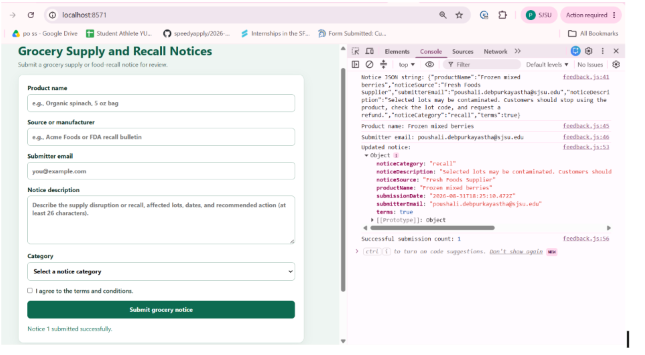

The ECS deployment is defined by `ecs-task-definition.json` and
`deploy_ecs.ps1`. It uses one Fargate task, port 80, public IP enabled, and an
HTTP security-group rule. Public IP: `http://98.84.7.49`

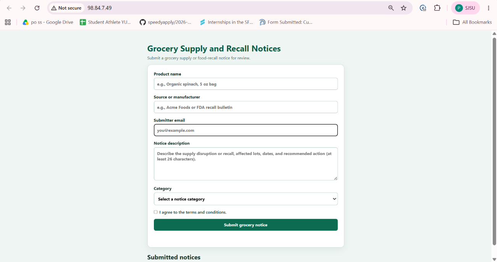

## Part 2 — Agentic AI

`agents_demo.py` sends the supplied title and content through Planner,
Reviewer, and Finalizer agents. The adapter requests JSON and the coercion layer
enforces exactly three tags and a summary of at most 25 words. No grocery
keywords are hardcoded into tag selection; candidates are derived from the
input text.

Exact command:

```text
python agents_demo.py --title "Frozen berries recalled after possible contamination" --content "A retailer is removing frozen mixed berries from selected lots after a supplier reported possible contamination. Customers should check lot codes, stop using affected packages, and contact the store for a refund." --email "poushali@example.com" --model qwen3:8b --temperature 0.0 --output reports/hw01/raw/agent_demo.json
```

Planner, Reviewer, Finalizer, and Publish JSON screenshots:

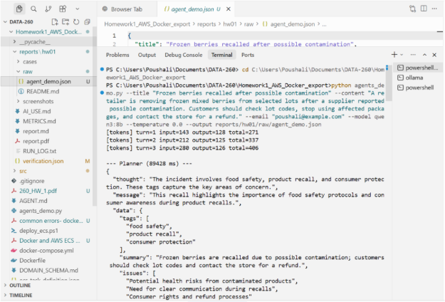
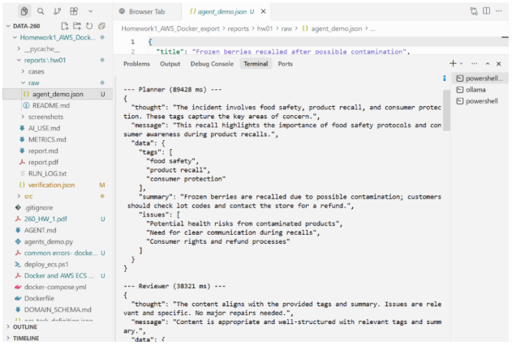
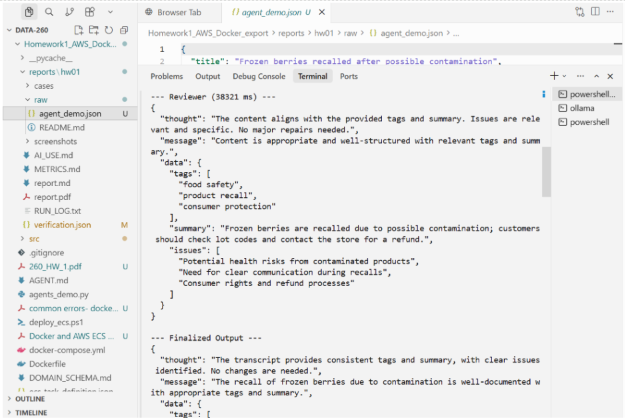
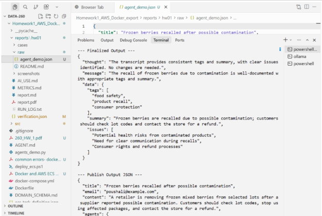
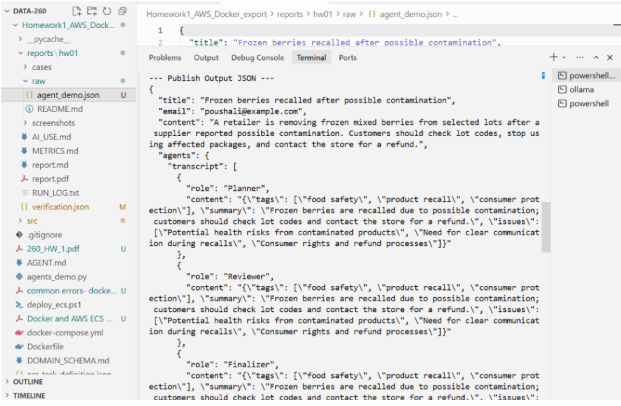
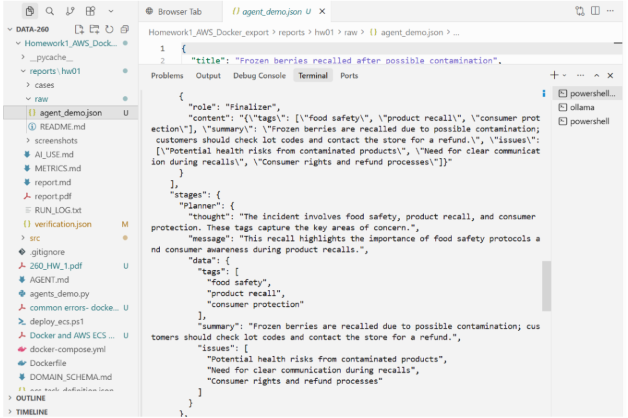
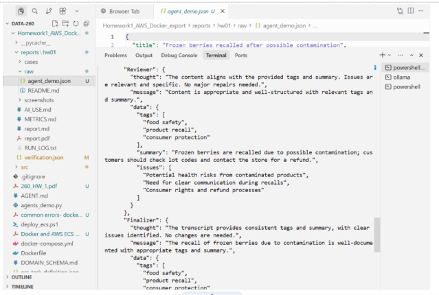
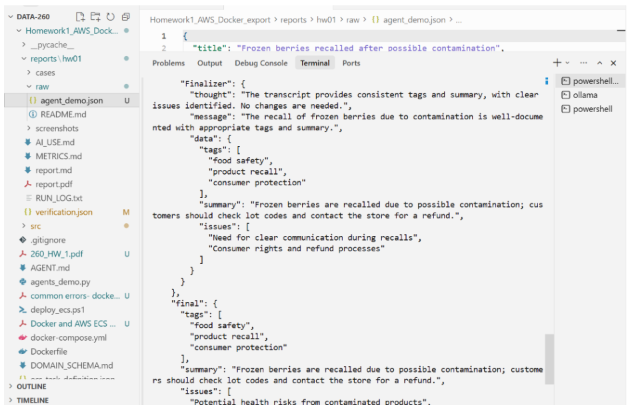
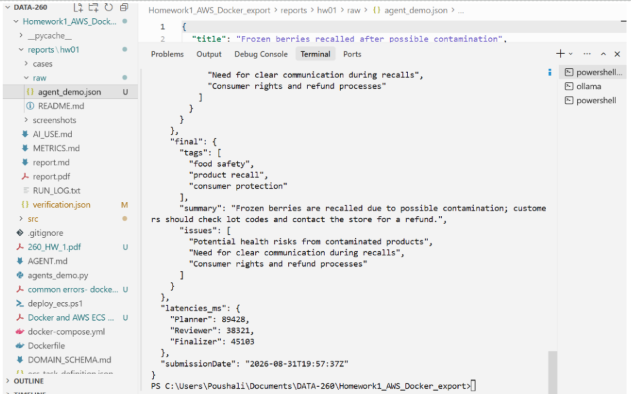

Q1 final tags: **food safety, product recall, consumer protection**

Q2 final summary: **Frozen berries are recalled due to possible contamination; customers should check lot codes and contact the store for a refund.**

Q3 Reviewer changed anything: **No. The Reviewer did not change the Planner’s tags or summary.**

Planner proposes input-derived tags and a summary. Reviewer checks relevance,
generic wording, and the word limit. Finalizer uses the transcript to publish
the strict final object.

## Part 3 — Non-determinism

The fixed case is saved in `cases/nondeterminism_input.json` and is unchanged
for all runs. The required command is:

```text
python run_nondeterminism.py --model qwen3:8b --runs-per-temperature 20
```

The command writes 20 temperature-0.7 and 20 temperature-0.0 results to
`raw/nondeterminism_runs.json`, including tags and latency.

| Metric | Temp 0.7 | Temp 0.0 |
|---|---|---|
| Distinct tag sets | 6 | 1 |
| Tags in all 20 runs | none | food safety, product recall, consumer protection |
| Tags in exactly 1 run | consumer advisory, contamination recall, customer recall action, frozen berries recall | none |
| Latency p50 / p95 / p99 (ms) | 79930 / 97093 / 98471 | 85534 / 93497 / 93591 |

Two users with identical input may see different tags or summaries at
temperature 0.7. This is acceptable for exploratory topic discovery, but not
for recall, safety, compliance, or other decisions that must be reproducible.

## Part 4 — Model client and token accounting

`src/model_client.py` is the sole Ollama call path and exposes
`complete(messages, tools=None)`. Each response prints input, output, and total
tokens; exit prints cumulative input/output tokens and turn count. `hw1_client.py`
loads `AGENT.md`, which requires strict bullet-only review output.

Exact five-turn command:

```text
python hw1_client.py --demo --model qwen3:8b
```

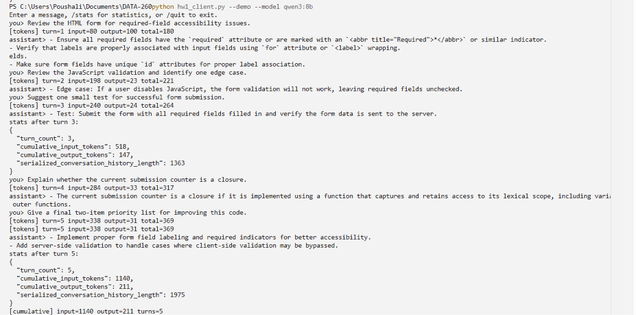

Stats after turn 3:

```text
turn_count: 3
cumulative_input_tokens: 518
cumulative_output_tokens: 147
serialized_conversation_history_length: 1363
```

Stats after turn 5:

```text
turn_count: 5
cumulative_input_tokens: 1140
cumulative_output_tokens: 211
serialized_conversation_history_length: 1975
```

Exit totals: input=1140 output=211 turns=5. Responses followed AGENT.md bullet-only review.

Prior conversation context is resent because Ollama chat completion is
stateless between HTTP requests; the model needs earlier messages to answer
follow-ups. A system prompt establishes behavior and constraints, while a user
message supplies a request or data. Input tokens grow because the serialized
history is included in each new request. The model context window and any
application truncation or summarization eventually limit growth.

## Verification and reproducibility

Run `python verify_hw01.py`; it writes `verification.json`. The report must be
updated with real screenshots, agent output, metrics, `/stats` captures, and the
final tagged commit hash before submission.
