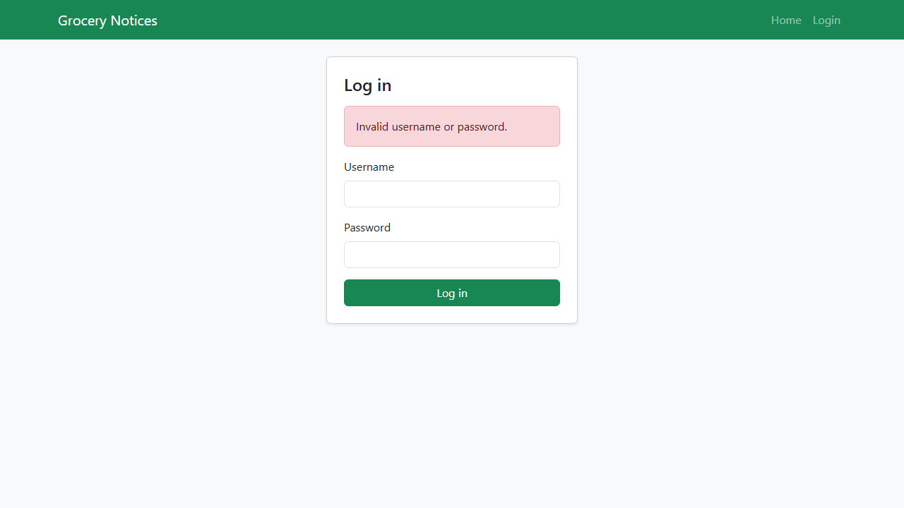
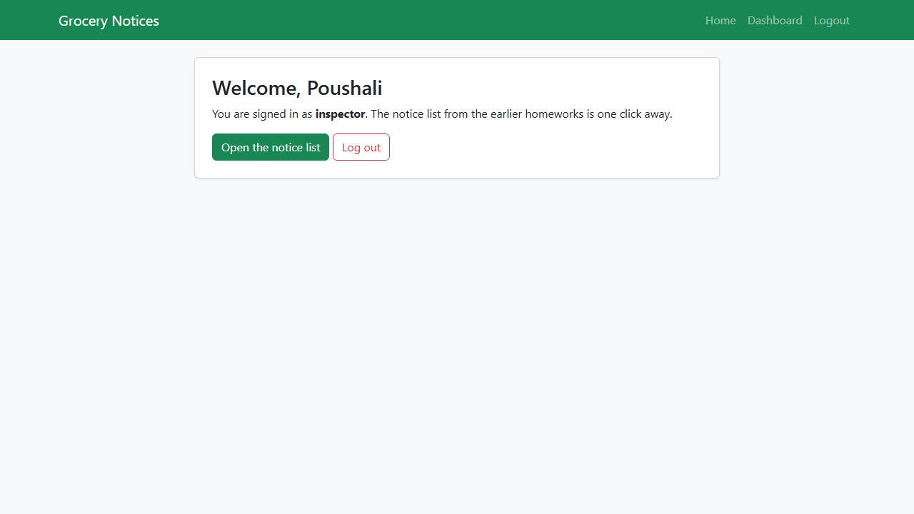
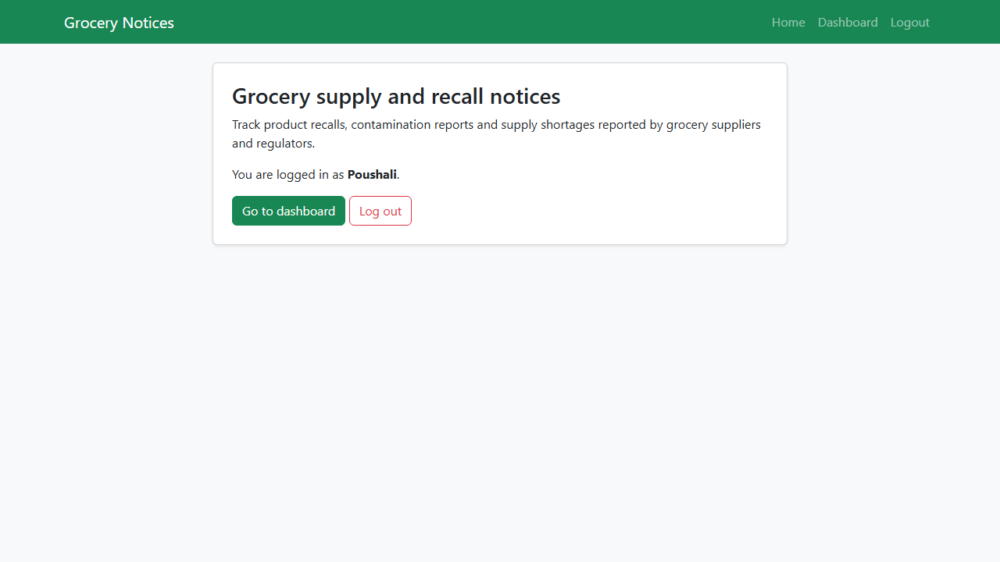
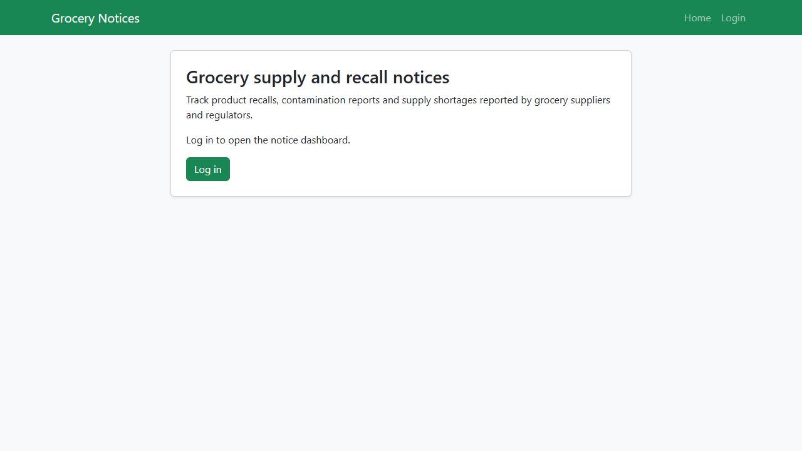
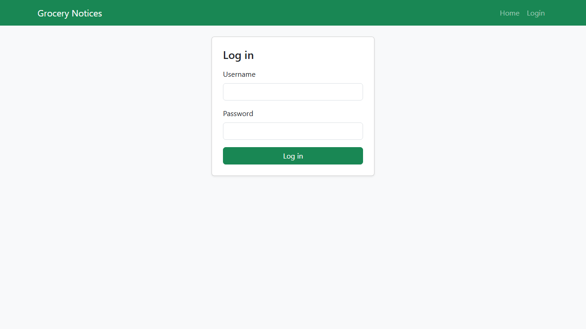
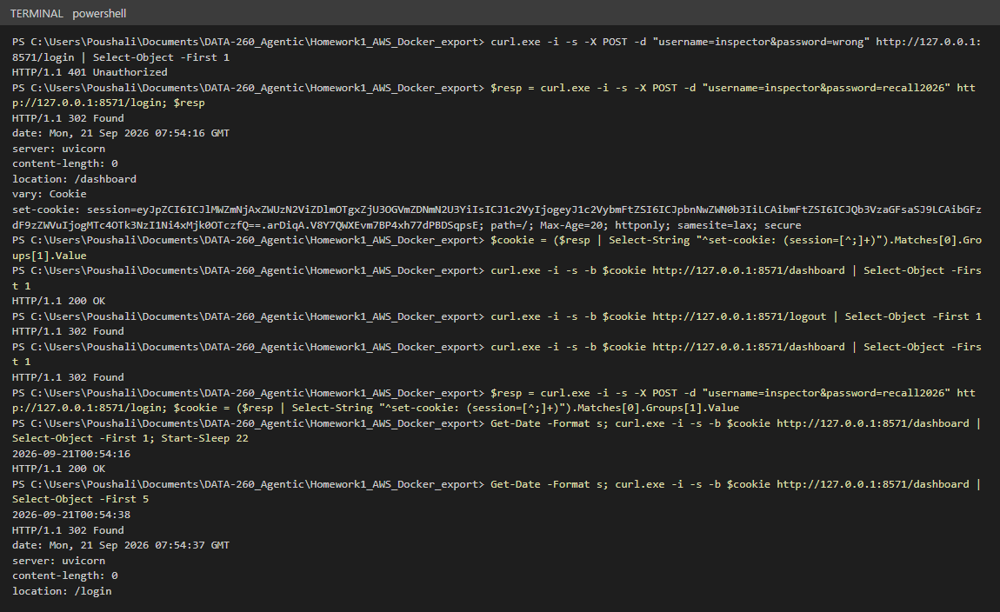
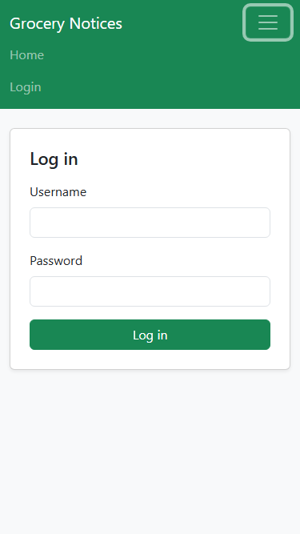
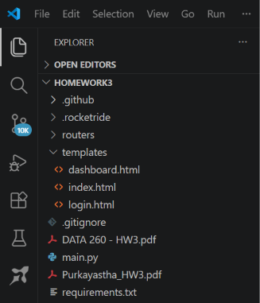
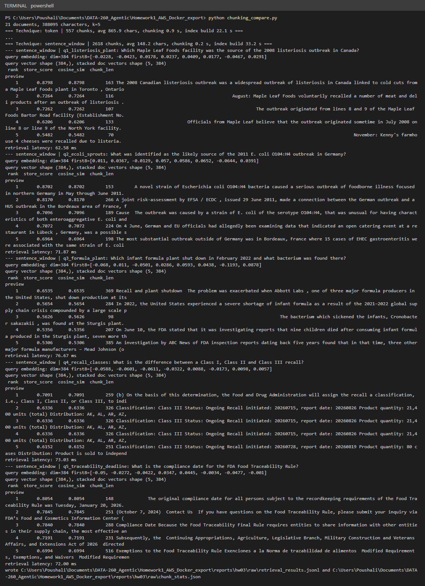
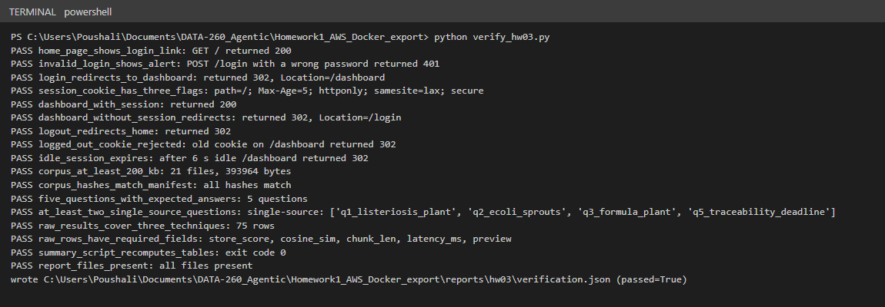

# DATA-260 Homework 3, Poushali Purkayastha

## Configuration

| Value | Result |
|---|---|
| SID4 | 0571 |
| PORT_BASE | 8000 + (571 mod 900) = 8571 |
| PREFIX | s0571 |
| SEED | 571 |
| VERIFY_SEED | 260571 |
| DOMAIN_ID | 571 mod 8 = 3, Grocery supply and recall notices |
| Hardware | Intel Core i5-1135G7 (4 cores, 8 threads), 15.8 GB RAM, Intel Iris Xe Graphics, Windows 11 Home, CPU only |
| Local model | `sentence-transformers/all-MiniLM-L6-v2` (384-dimensional sentence embeddings, pulled from Hugging Face, run on CPU). This homework is retrieval only, so no LLM is called. |
| Software | Python 3.12.10, fastapi 0.141.1, starlette 1.0.0, uvicorn 0.46.0, jinja2 3.1.6, itsdangerous 2.2.0, llama-index 0.14.24, llama-index-embeddings-huggingface 0.8.0, sentence-transformers 6.0.1, torch 2.14.0, numpy 2.4.4, pandas 3.0.2, faiss-cpu 1.15.0 |
| Repository | https://github.com/Poushali0202/data260-0571 (collaborators Sbnikitha and supriyaselvanganesan) |
| Tagged commit | `hw3` = 86892f0b7f5ee62e12b05dd15fa613f632148b48 |

The HW1 and HW2 code is extended in place. `app.py` keeps the HW2 notice API and now adds Starlette's `SessionMiddleware` and the new router `routers/auth.py` with the Jinja templates in `templates/`; the HW2 notice page moved from `/` to `/notices` so that `/` can be the home page asked for here. New root-level files: `fetch_corpus.py`, `corpus/` (21 domain documents), `chunking_compare.py`, `summarize_retrieval.py`, `verify_hw03.py`, and the `verify-hw03` target in the Makefile. Everything for this homework is in `reports/hw03/`: `RUN_LOG.txt`, `raw/`, `METRICS.md`, `AI_USE.md`, `README.md` (run instructions), `verification.json`, `SOURCES.md`, `CORPUS_MANIFEST.json`, `questions.yaml`, and `screenshots/`.

## Part 1: FastAPI login system

### Routes

All four routes live in `routers/auth.py` and are registered with `app.include_router(auth_router)`. The home page shows a welcome message for the grocery notice application with a login link, or the dashboard and logout links once a user is logged in. The login page validates the form against a small user table, redirects to `/dashboard` on success, and re-renders the form with a Bootstrap `alert-danger` (status 401) when the credentials are wrong. The dashboard greets the user by name, links to the notice list and to logout, and redirects anonymous or expired sessions to `/login`. Logout removes the session id from the server-side set, clears the session, and redirects to `/`.

Home page (`/`) while logged out:


Login page (`/login`):


Login page after a wrong password (Bootstrap alert):



Dashboard (`/dashboard`) after logging in as `inspector`:



Home page while logged in (dashboard and logout links):



`/logout` destroys the session and lands on the home page again:



Opening `/dashboard` after logout redirects to `/login`:



### Session management

`app.py` installs the middleware with a secure cookie and a `Max-Age` equal to the idle timeout:

```python
app.add_middleware(
    SessionMiddleware,
    secret_key=os.getenv("SECRET_KEY", "replace-me-s0571"),
    max_age=IDLE_TIMEOUT,
    same_site="lax",
    https_only=True,
)
app.include_router(auth_router)
```

Login stores the user (`username` and display name), a random session id and a `last_seen` timestamp in the session. The `Set-Cookie` header returned by a successful login carries all three attributes, `httponly`, `samesite=lax` and `secure` (captured with curl, full output in `RUN_LOG.txt`):

```
$ curl -i -s -X POST -d "username=inspector&password=recall2026" http://127.0.0.1:8571/login
HTTP/1.1 302 Found
location: /dashboard
vary: Cookie
set-cookie: session=eyJpZCI6ICIzOTk0NjYzNWFlZmFlNTVjZDRhOTFjNjlhMjQwZjQ4NyIsICJ1c2VyIjogeyJ1c2VybmFtZSI6ICJpbnNwZWN0b3IiLCAibmFtZSI6ICJQb3VzaGFsaSJ9LCAibGFzdF9zZWVuIjogMTc4OTk3NTMxNC4wMzE4MDc3fQ==.arDbEg.dWcM-22byFEEfxg5ChwM0WBfS0Q; path=/; Max-Age=20; httponly; samesite=lax; secure
```

Idle timeout: `current_user()` compares the stored `last_seen` with the current time and clears the session when the gap is longer than `IDLE_TIMEOUT` (600 seconds by default, `IDLE_TIMEOUT_SECONDS` in the environment). Every request by a logged-in user refreshes `last_seen`, which also re-signs the cookie, so the `Max-Age` of the cookie slides along with the activity. The server also keeps a set of active session ids: logout removes the id, so a copy of a logged-out cookie is refused even though its signature is still valid. The proof below was recorded against a server started with `IDLE_TIMEOUT_SECONDS=20`. The same cookie is sent to `/dashboard` after logging out, and again after 22 seconds of inactivity; both attempts are redirected to `/login`:

```
$ curl -i -s -b "$COOKIE" http://127.0.0.1:8571/logout
HTTP/1.1 302 Found
location: /
set-cookie: session=null; path=/; expires=Thu, 01 Jan 1970 00:00:00 GMT; httponly; samesite=lax; secure

$ curl -i -s -b "$COOKIE" http://127.0.0.1:8571/dashboard   (same cookie replayed after logout)
HTTP/1.1 302 Found
location: /login

$ date; curl -i -s -b "$COOKIE" http://127.0.0.1:8571/dashboard | head -1   (fresh login)
2026-09-21T00:21:54-07:00
HTTP/1.1 200 OK
$ sleep 22
$ date; curl -i -s -b "$COOKIE" http://127.0.0.1:8571/dashboard   (same cookie after 22 s idle)
2026-09-21T00:22:16-07:00
HTTP/1.1 302 Found
location: /login
```



### Styling with Bootstrap

Every page extends `templates/base.html`, which loads Bootstrap 5.3 from the CDN and renders a `navbar` with a `navbar-toggler` that collapses below the `md` breakpoint. Content sits in `card` components inside a centred `row`/`col` grid, actions are `btn btn-success` and `btn-outline-danger` buttons, and the login error is an `alert alert-danger`. At 375px the navbar collapses into the toggler menu and the card fills the width:



### routers/auth.py

```python
import os
import secrets
import time
from pathlib import Path

from fastapi import APIRouter, Form, Request
from fastapi.responses import RedirectResponse
from fastapi.templating import Jinja2Templates

router = APIRouter()
templates = Jinja2Templates(directory=Path(__file__).resolve().parent.parent / "templates")

USERS = {
    "inspector": {"password": "recall2026", "name": "Poushali"},
    "manager": {"password": "shelf2026", "name": "Store Manager"},
}
IDLE_TIMEOUT = int(os.getenv("IDLE_TIMEOUT_SECONDS", "600"))
ACTIVE_SESSIONS = set()


def current_user(request: Request):
    user = request.session.get("user")
    session_id = request.session.get("id")
    idle = time.time() - request.session.get("last_seen", 0)
    if not user or session_id not in ACTIVE_SESSIONS or idle > IDLE_TIMEOUT:
        ACTIVE_SESSIONS.discard(session_id)
        request.session.clear()
        return None
    request.session["last_seen"] = time.time()
    return user


@router.get("/")
def home(request: Request):
    return templates.TemplateResponse(request, "index.html", {"user": current_user(request)})


@router.get("/login")
def login_page(request: Request):
    return templates.TemplateResponse(request, "login.html", {"user": current_user(request), "error": None})


@router.post("/login")
def login(request: Request, username: str = Form(), password: str = Form()):
    account = USERS.get(username)
    if account is None or account["password"] != password:
        context = {"user": None, "error": "Invalid username or password."}
        return templates.TemplateResponse(request, "login.html", context, status_code=401)
    session_id = secrets.token_hex(16)
    ACTIVE_SESSIONS.add(session_id)
    request.session["id"] = session_id
    request.session["user"] = {"username": username, "name": account["name"]}
    request.session["last_seen"] = time.time()
    return RedirectResponse("/dashboard", status_code=302)


@router.get("/dashboard")
def dashboard(request: Request):
    user = current_user(request)
    if not user:
        return RedirectResponse("/login", status_code=302)
    return templates.TemplateResponse(request, "dashboard.html", {"user": user})


@router.get("/logout")
def logout(request: Request):
    ACTIVE_SESSIONS.discard(request.session.get("id"))
    request.session.clear()
    return RedirectResponse("/", status_code=302)
```

### Templates directory

```
templates/
    base.html
    dashboard.html
    index.html
    login.html
```



## Part 2: three LlamaIndex chunking techniques, retrieval only

### Environment

`pip install llama-index llama-index-embeddings-huggingface sentence-transformers faiss-cpu numpy pandas` (pinned in `requirements.txt`). The embedding model is `sentence-transformers/all-MiniLM-L6-v2` from Hugging Face, loaded through `HuggingFaceEmbedding` and run on the CPU. It produces 384-dimensional vectors and reads at most 256 wordpiece tokens of a text; anything longer is cut off before it is embedded, which matters for the semantic splitter below.

### Corpus

The graded corpus is 21 plain-text snapshots of public documents about grocery recalls and supply (393,964 bytes, well above the 200 KB minimum): 13 Wikipedia articles (product recalls, FSMA, FSIS, the Peanut Corporation of America, the 2008 Canadian listeriosis outbreak, the 2006 spinach and 2011 German E. coli outbreaks, the 2022 infant formula shortage, the 2021 to 2023 supply chain crisis, cold chain, traceability, food distribution, grocery stores), five FDA pages (recall definitions, FDA 101 on recalls, food recalls for consumers, the FSMA Food Traceability Rule, the FSMA preventive controls rule), a USDA ERS page on food service market segments, 21 CFR Part 7 Subpart C from the eCFR API, and the 100 most recent openFDA food enforcement reports. `fetch_corpus.py` downloads them, strips the HTML, and writes `CORPUS_MANIFEST.json` with the byte size and SHA-256 of every file; `SOURCES.md` lists the URLs and access dates. Tiny Shakespeare is used only as a warm-up and is not committed.

```
$ python fetch_corpus.py
  54940 bytes  wikipedia_product_recall.txt
  33890 bytes  wikipedia_fda_food_safety_modernization_act.txt
  11984 bytes  wikipedia_food_safety_and_inspection_service.txt
   ...
  19297 bytes  ecfr_21_cfr_part_7_subpart_c_recalls.txt
  69543 bytes  openfda_food_enforcement_reports.txt
21 files, 393964 bytes total, manifest written to reports\hw03\CORPUS_MANIFEST.json
```

### One retrieval-only pipeline per technique

`chunking_compare.py` loads every corpus file as a `Document` whose only metadata is the file name (excluded from the embedded text), builds the three node parsers, indexes each set of nodes in a `VectorStoreIndex` backed by the default in-memory `SimpleVectorStore`, and runs the same retrieval helper for every question.

```python
def build_chunkers(embed_model):
    return {
        "token": TokenTextSplitter(chunk_size=200, chunk_overlap=40),
        "semantic": SemanticSplitterNodeParser(buffer_size=1, breakpoint_percentile_threshold=95, embed_model=embed_model),
        "sentence_window": SentenceWindowNodeParser.from_defaults(
            window_size=3, window_metadata_key="window", original_text_metadata_key="original_text"
        ),
    }
```

Token: 200 tokens with a 40 token overlap, chosen so that every chunk fits inside the 256 wordpiece window of the embedding model (the largest token chunk is 218 wordpieces). Semantic: buffer of one sentence and the default 95th percentile breakpoint, using the same MiniLM model to find the boundaries. Sentence window: single sentences as nodes with the three sentences on each side stored in the `window` metadata, which is excluded from the embedding.

```python
def retrieve(technique, index, embed_model, question, k):
    query_vec = np.array(embed_model.get_query_embedding(question["question"]))
    print(f"query embedding: dim={query_vec.shape[0]} first8={np.round(query_vec[:8], 4).tolist()}")
    retriever = index.as_retriever(similarity_top_k=k)
    start = time.perf_counter()
    hits = retriever.retrieve(QueryBundle(query_str=question["question"], embedding=query_vec.tolist()))
    latency_ms = (time.perf_counter() - start) * 1000
    doc_vecs = np.array([embed_model.get_text_embedding(hit.node.get_content(metadata_mode=MetadataMode.EMBED)) for hit in hits])
    print(f"query vector shape {query_vec.shape}, stacked doc vectors shape {doc_vecs.shape}")
    rows = []
    for rank, (hit, doc_vec) in enumerate(zip(hits, doc_vecs), start=1):
        text = hit.node.get_content(metadata_mode=MetadataMode.NONE)
        window = hit.node.metadata.get("window")
        rows.append({
            "technique": technique,
            "question_id": question["id"],
            "question": question["question"],
            "expected_source": question["expected_source"],
            "rank": rank,
            "store_score": round(float(hit.score), 4),
            "cosine_sim": round(cosine(query_vec, doc_vec), 4),
            "chunk_len": len(text),
            "preview": text[:160].replace("\n", " "),
            "source_file": hit.node.metadata.get("source_file"),
            "source_hit": hit.node.metadata.get("source_file") == question["expected_source"],
            "contains_answer": contains_all(window or text, question["answer_keywords"]),
            "latency_ms": round(latency_ms, 2),
            "text": text,
            "window": window,
        })
    table = pd.DataFrame(rows)[["rank", "store_score", "cosine_sim", "chunk_len", "preview"]]
    print(table.to_string(index=False))
    print(f"retrieval latency: {latency_ms:.2f} ms")
    return rows
```

The query embedding is computed once and passed to the retriever inside a `QueryBundle`, so the timer only measures the similarity search. The cosine column recomputes the embedding of every returned chunk explicitly and compares it with the query vector; it matches the retriever's `store_score` to four decimals, which confirms that `SimpleVectorStore` scores with cosine similarity. `contains_answer` checks whether the chunk (for the sentence-window index, the stored window, which is what a reader model would receive) contains the answer phrases from `questions.yaml`, matched as whole words. Every row is appended to `raw/retrieval_results.jsonl`, the chunk counts and average lengths go to `raw/chunk_stats.json`, and `summarize_retrieval.py` rebuilds the tables below from those two files.

### Warm-up on Tiny Shakespeare

`python chunking_compare.py --warmup` downloads the file, keeps the first 100 KB (the opening of Coriolanus) and asks "Why do the citizens want to kill Caius Marcius?". The expected line is "First, you know Caius Marcius is chief enemy to the people."

| Technique | Chunks | Avg chunk length (chars) | Top-1 cosine | Mean@5 cosine | Recall@5 | Retrieval latency (ms) |
|---|---|---|---|---|---|---|
| token | 174 | 714.4 | 0.5275 | 0.4913 | 0.0 | 6.18 |
| semantic | 59 | 1694.9 | 0.5070 | 0.4581 | 0.0 | 2.28 |
| sentence_window | 1156 | 86.5 | 0.7100 | 0.6205 | 1.0 | 30.43 |

```
=== Technique: sentence_window | 1156 chunks, avg 86.5 chars, chunking 0.1 s, index build 15.6 s ===

--- sentence_window | warmup: Why do the citizens want to kill Caius Marcius?
query embedding: dim=384 first8=[0.0009, 0.0291, -0.032, -0.0314, -0.0114, -0.0144, 0.0789, -0.0146]
query vector shape (384,), stacked doc vectors shape (5, 384)
 rank  store_score  cosine_sim  chunk_len                                                                                                       preview
    1       0.7100      0.7100         76                                  First Citizen: First, you know Caius Marcius is chief enemy to the people.
    2       0.6639      0.6639         69                                         Second Citizen: Would you proceed especially against Caius Marcius?
    3       0.6468      0.6468         35                                                                           Messenger: Where's Caius Marcius?
    4       0.5498      0.5498         32                                                                              MARCIUS: How lies their battle?
    5       0.5319      0.5319        109 If we and Caius Marcius chance to meet, 'Tis sworn between us we shall ever strike Till one can do no more.
retrieval latency: 30.43 ms
```

Only the sentence-window index put the answer line first; the token and semantic chunks that scored highest were crowd scenes about Marcius that do not contain the line. The script and output format were checked here before the graded run.

### Questions

`questions.yaml` was committed (commit `9f51aaf`) before the graded comparison was run. Four of the five questions depend on a single source file.

| Id | Question | Expected source | Single source |
|---|---|---|---|
| q1_listeriosis_plant | Which Maple Leaf Foods facility was the source of the 2008 listeriosis outbreak in Canada? | wikipedia_2008_canadian_listeriosis_outbreak.txt | yes |
| q2_ecoli_sprouts | What was identified as the likely source of the 2011 E. coli O104:H4 outbreak in Germany? | wikipedia_2011_germany_e_coli_outbreak.txt | yes |
| q3_formula_plant | Which infant formula plant shut down in February 2022 and what bacterium was found there? | wikipedia_2022_infant_formula_shortage.txt | yes |
| q4_recall_classes | What is the difference between a Class I, Class II and Class III recall? | fda_recalls_background_and_definitions.txt | no |
| q5_traceability_deadline | What is the compliance date for the FDA Food Traceability Rule? | fda_fsma_food_traceability_rule.txt | yes |

The expected answers are in the file. One scoring detail changed after the first run: the answer phrases for q4 were originally the class names, and a plain substring test counted "Class I" inside "Class II" and "Class III", so openFDA records that only say "Classification: Class II" were marked as containing the answer. The check now matches whole phrases and q4 uses the two defining phrases ("serious adverse health consequences", "medically reversible"); the questions and expected answers themselves were not changed.

### Results: retrieval quality, five questions, k=5

`python chunking_compare.py` took 2 min 29 s in total (00:27:52 to 00:30:21 local time, console output in `RUN_LOG.txt`). The tables come from `python summarize_retrieval.py` and are also in `METRICS.md`.

| Technique | Chunks | Avg chunk length (chars) | Top-1 cosine | Mean@5 cosine | Recall@5 | Mean retrieval latency (ms) |
|---|---|---|---|---|---|---|
| token | 557 | 865.9 | 0.7368 | 0.6388 | 1.0 | 21.55 |
| semantic | 157 | 2471.9 | 0.7088 | 0.5787 | 1.0 | 6.41 |
| sentence_window | 2618 | 148.2 | 0.7836 | 0.6867 | 0.8 | 71.23 |

Top-1 and Mean@5 are averaged over the five questions; Recall@5 is the share of questions with an answer-bearing chunk in the top 5. Build cost: token 0.9 s chunking and 22.1 s index build, semantic 67.1 s and 7.3 s, sentence window 0.2 s and 33.2 s. Chunk sizes measured in wordpieces of the embedding model:

| Technique | Chunks | Wordpieces min / median / max | Chunks longer than the 256 wordpiece window |
|---|---|---|---|
| token | 557 | 56 / 192 / 218 | 0 (0.0%) |
| semantic | 157 | 6 / 304 / 5923 | 86 (54.8%) |
| sentence_window | 2618 | 4 / 28 / 693 | 6 (0.2%) |

Per question:

| Question | Technique | Top-1 cosine | Mean@5 | Answer found at rank | Expected source in top-k | Latency (ms) |
|---|---|---|---|---|---|---|
| q1_listeriosis_plant | token | 0.8777 | 0.6654 | 1 | yes | 16.25 |
| q2_ecoli_sprouts | token | 0.7582 | 0.7225 | 1 | yes | 19.56 |
| q3_formula_plant | token | 0.6724 | 0.5654 | 1 | yes | 23.84 |
| q4_recall_classes | token | 0.5988 | 0.5146 | 1 | yes | 28.73 |
| q5_traceability_deadline | token | 0.7767 | 0.7258 | 1 | yes | 19.39 |
| q1_listeriosis_plant | semantic | 0.8778 | 0.619 | 1 | yes | 7.61 |
| q2_ecoli_sprouts | semantic | 0.7316 | 0.6486 | 1 | yes | 6.16 |
| q3_formula_plant | semantic | 0.6494 | 0.5314 | 1 | yes | 5.71 |
| q4_recall_classes | semantic | 0.6086 | 0.4594 | 1 | yes | 5.24 |
| q5_traceability_deadline | semantic | 0.6765 | 0.635 | 2 | yes | 7.34 |
| q1_listeriosis_plant | sentence_window | 0.8798 | 0.7002 | 1 | yes | 62.58 |
| q2_ecoli_sprouts | sentence_window | 0.8702 | 0.7601 | 1 | yes | 71.87 |
| q3_formula_plant | sentence_window | 0.6535 | 0.5695 | 1 | yes | 76.67 |
| q4_recall_classes | sentence_window | 0.7091 | 0.645 | none | no | 73.03 |
| q5_traceability_deadline | sentence_window | 0.8054 | 0.7585 | 1 | yes | 72.0 |

### Printed output for the shared query q5

The three blocks below are the console output for "What is the compliance date for the FDA Food Traceability Rule?" (query embedding with dimension and first eight values, the vector shapes, the rank table and the latency), one per technique.

```
--- token | q5_traceability_deadline: What is the compliance date for the FDA Food Traceability Rule?
query embedding: dim=384 first8=[-0.05, -0.0272, -0.0422, 0.0347, 0.0445, -0.0034, -0.0477, -0.001]
query vector shape (384,), stacked doc vectors shape (5, 384)
 rank  store_score  cosine_sim  chunk_len                                                                                                                                      
    1       0.7767      0.7767        940 Food Traceability Final Rule requires entities to share information with other entities in their supply chain, the most effective and
    2       0.7257      0.7257       1048 The new requirements identified in the final rule will allow for faster identification and rapid removal of potentially contaminated 
    3       0.7145      0.7145        951 compliance.  This meeting was part of a series of engagements being held in accordance with a directive from Congress in the  Continu
    4       0.7123      0.7123        890 Foundation held a virtual public meeting to hear insights on the Food Traceability Rule from both FDA leadership and other experts fr
    5       0.7000      0.7000        306 Safety Rule and the Food Traceability Rule Risk-ranking Model Results Tool Tracking and Tracing of Food Discussion Paper: Identifying
retrieval latency: 19.39 ms

--- semantic | q5_traceability_deadline: What is the compliance date for the FDA Food Traceability Rule?
query embedding: dim=384 first8=[-0.05, -0.0272, -0.0422, 0.0347, 0.0445, -0.0034, -0.0477, -0.001]
query vector shape (384,), stacked doc vectors shape (5, 384)
 rank  store_score  cosine_sim  chunk_len                                                                                                                                      
    1       0.6765      0.6765       2400 Federal Register Notice Docket Folder  FDA-2011-N-0920  provides the full text of the Rule Questions & Answers Fact Sheet Generally, 
    2       0.6491      0.6491       4525 What  Critical Tracking Events (CTEs)  do you conduct? What  Key Data Elements (KDEs)  do you already maintain? What additional KDEs 
    3       0.6375      0.6375       9827 The exemptions are listed in § 1.1305 of the final rule.    A tool is available to help stakeholders determine whether an exemption m
    4       0.6095      0.6095       1926 The agency estimated that it would require at least 1,000 more inspectors and $1.4 billion over the following five years, with uncert
    5       0.6024      0.6024       3709 What's New The FDA held a public meeting on June 15, 2026, to give the public an opportunity to share information on continued implem
retrieval latency: 7.34 ms

--- sentence_window | q5_traceability_deadline: What is the compliance date for the FDA Food Traceability Rule?
query embedding: dim=384 first8=[-0.05, -0.0272, -0.0422, 0.0347, 0.0445, -0.0034, -0.0477, -0.001]
query vector shape (384,), stacked doc vectors shape (5, 384)
 rank  store_score  cosine_sim  chunk_len                                                                                                                                      
    1       0.8054      0.8054        148             The original compliance date for all persons subject to the recordkeeping requirements of the Food Traceability Rule was 
    2       0.7845      0.7845        251 (October 7, 2024)  Contact Us  If you have questions on the Food Traceability Rule, please submit your inquiry via FDA’s Food and Cos
    3       0.7840      0.7840        288 Compliance Date Because the Food Traceability Final Rule requires entities to share information with other entities in their supply c
    4       0.7191      0.7191        231 Subsequently, the  Continuing Appropriations, Agriculture, Legislative Branch, Military Construction and Veterans Affairs, and Extens
    5       0.6994      0.6994        516 Exemptions to the Food Traceability Rule Exenciones a la Norma de trazabilidad de alimentos  Modified Requirements, Exemptions, and W
retrieval latency: 72.00 ms
```



### Confidently scored retrievals that do not contain the answer

| Question | Technique | Rank | Cosine | Source file | What the chunk says |
|---|---|---|---|---|---|
| q5_traceability_deadline | semantic | 1 | 0.6765 | fda_fsma_preventive_controls_human_food.txt | A 2,400 character chunk about the FSMA preventive controls rule: its Federal Register docket, "requires food facilities to have a food safety plan", "Compliance dates are staggered, based on the size of the business". No mention of the traceability rule or of January 20, 2026. |
| q4_recall_classes | sentence_window | 1 | 0.7091 | ecfr_21_cfr_part_7_subpart_c_recalls.txt | 21 CFR 7.41(b): "the Food and Drug Administration will assign the recall a classification, i.e., Class I, Class II, or Class III, to indicate the relative degree of health hazard". It names the classes but never defines them. |
| q4_recall_classes | sentence_window | 2 to 5 | 0.6336 to 0.6152 | openfda_food_enforcement_reports.txt | Lines such as "Classification: Class II" from individual enforcement records. |
| q5_traceability_deadline | token | 2 to 5 | 0.7257 to 0.7000 | fda_fsma_food_traceability_rule.txt | Paragraphs about the traceability rule (benefits, public meetings, tools) without the compliance date. |

The sentence-window output for q4 shows the second case:

```
--- sentence_window | q4_recall_classes: What is the difference between a Class I, Class II and Class III recall?
query embedding: dim=384 first8=[-0.0588, -0.0601, -0.0611, -0.0322, 0.0088, -0.0173, 0.0098, 0.0057]
query vector shape (384,), stacked doc vectors shape (5, 384)
 rank  store_score  cosine_sim  chunk_len                                                                                                                                      
    1       0.7091      0.7091        259 (b) On the basis of this determination, the Food and Drug Administration will assign the recall a classification, i.e., Class I, Clas
    2       0.6336      0.6336        326 Classification: Class III Status: Ongoing Recall initiated: 20260715, report date: 20260826 Product quantity: 21,400 units (total) Di
    3       0.6336      0.6336        326 Classification: Class III Status: Ongoing Recall initiated: 20260715, report date: 20260826 Product quantity: 21,400 units (total) Di
    4       0.6336      0.6336        326 Classification: Class III Status: Ongoing Recall initiated: 20260715, report date: 20260826 Product quantity: 21,400 units (total) Di
    5       0.6152      0.6152        251 Classification: Class III Status: Ongoing Recall initiated: 20260728, report date: 20260819 Product quantity: 80 cases Distribution: 
retrieval latency: 73.03 ms
```

Why the embedding considered them similar: the q5 semantic miss shares almost all of the question's vocabulary (FDA, FSMA, rule, compliance date), and the model cannot tell the preventive controls rule from the traceability rule when the one distinguishing word, "traceability", is absent from the part of the chunk that was embedded. The traceability chunk that holds the date is 4,525 characters long, the date sits far past the 256 wordpiece cut-off, and its embedded head is about critical tracking events and key data elements, so it landed at rank 2 (0.6491). The q4 sentence-window miss is the opposite case: a single sentence that lists "Class I, Class II, or Class III" next to "recall" and "health hazard" is an almost perfect lexical match for a question that lists the same three names, while the actual definitions on the FDA page are written as a label line ("Class I recall:") followed by the definition on the next line, so the sentence splitter stores the label and the definition as separate short nodes and neither one alone scores well.

### Observations

The sentence-window index has the highest top-1 and mean@5 cosines and put the exact answer sentence first for four of the five questions (for example "The original compliance date for all persons subject to the recordkeeping requirements of the Food Traceability Rule was Tuesday, January 20, 2026" at 0.8054, and the Bartor Road sentence at 0.8798). A one-sentence node is the closest thing to a one-sentence question, so the scores are high, and the three-sentence window carries the context that the node itself lacks. The cost is 2,618 vectors instead of 557, which makes the linear search about three times slower than the token index (71 ms against 22 ms), and the q4 failure, where a sentence that names the topic beats the sentences that answer the question. Token chunks of 200 tokens with a 40 token overlap were the most robust: the answer was at rank 1 for every question, every chunk fits inside the model window, and each hit brings roughly 870 characters of surrounding text with it. Its cosines are lower than the sentence-window ones because each chunk also contains material unrelated to the query.

The semantic splitter found coherent boundaries (its q1 chunk is exactly the "Origin of the outbreak" section) but produced chunks that average 2,472 characters, and 55% of them are longer than the 256 wordpieces MiniLM reads, so most of a long chunk never influences its embedding. That is why it has the lowest mean@5 (0.5787), why the q5 answer dropped to rank 2, and why one retrieved chunk is 9,827 characters long. It is the fastest at query time (157 vectors, 6.4 ms) and the slowest to build (67 s of sentence embeddings for boundary detection). The best technique does change with the query: sentence window had the highest top-1 cosine on q1, q2, q4 and q5 and token on q3, but on q4 only token and semantic actually returned the definitions. On the Tiny Shakespeare warm-up the sentence-window index was the only one to put the answer line first.

### Conclusion

For this corpus I judge token chunking (200 tokens, 40 overlap) the best of the three: it is the only technique that returned a chunk containing the answer at rank 1 for all five questions, none of its 557 chunks exceeds the embedding window, and each hit carries enough context to answer from, at 22 ms per search. Sentence-window chunking scores highest on cosine (0.7836 top-1, 0.6867 mean@5) and is the better choice when a question maps to a single sentence, but it missed the recall class definitions entirely and needs three times the search time plus the window post-processing step. Semantic chunking gave the lowest scores here because its oversized chunks are truncated by the 256 token model; it would need a smaller breakpoint threshold or a longer-context embedding model to compete.

## Verification

`python verify_hw03.py` (also `make verify-hw03`) starts the app on port 8571 with a 5 second idle timeout, checks the four routes, the three cookie attributes, the logout and idle replays, the corpus size and SHA-256 hashes, the five questions, the raw results for all three techniques, and that `summarize_retrieval.py` recomputes the tables, then writes `reports/hw03/verification.json`.

```
$ date
2026-09-21T00:34:15-07:00
$ python verify_hw03.py
PASS home_page_shows_login_link: GET / returned 200
PASS invalid_login_shows_alert: POST /login with a wrong password returned 401
PASS login_redirects_to_dashboard: returned 302, Location=/dashboard
PASS session_cookie_has_three_flags: path=/; Max-Age=5; httponly; samesite=lax; secure
PASS dashboard_with_session: returned 200
PASS dashboard_without_session_redirects: returned 302, Location=/login
PASS logout_redirects_home: returned 302
PASS logged_out_cookie_rejected: old cookie on /dashboard returned 302
PASS idle_session_expires: after 6 s idle /dashboard returned 302
PASS corpus_at_least_200_kb: 21 files, 393964 bytes
PASS corpus_hashes_match_manifest: all hashes match
PASS five_questions_with_expected_answers: 5 questions
PASS at_least_two_single_source_questions: single-source: ['q1_listeriosis_plant', 'q2_ecoli_sprouts', 'q3_formula_plant', 'q5_traceability_deadline']
PASS raw_results_cover_three_techniques: 75 rows
PASS raw_rows_have_required_fields: store_score, cosine_sim, chunk_len, latency_ms, preview
PASS summary_script_recomputes_tables: exit code 0
PASS report_files_present: all files present
wrote C:\Users\Poushali\Documents\DATA-260_Agentic\Homework1_AWS_Docker_export\reports\hw03\verification.json (passed=True)
exit code 0
```



## AI-use statement

Same text as `reports/hw03/AI_USE.md`.

1. I used an AI assistant for debugging and for preparing the report document
   (`report.md` / `report.pdf`). The debugging help covered the login flow (why a
   replayed cookie still opened the dashboard, why the smoke test looked slow),
   the Wikipedia rate limit that broke the first corpus download, a console
   encoding error on a narrow no-break space in the FDA text, and the reportlab
   layout. I wrote and ran the application code, the chunking comparison, the
   corpus fetch script and the smoke test myself, chose the corpus sources, wrote
   the five questions before running the comparison, reviewed every output file,
   and made the Canvas submission.

2. One thing I verified myself was the logout. The first version of the logout
   route only cleared the session, so the browser dropped the cookie, but a copy
   of the signed cookie stayed valid until its `Max-Age` ran out: replaying it
   with curl after `/logout` still returned `200 OK` from `/dashboard`. A second
   unsuitable result was my own answer check in the retrieval script: it counted
   "Class I" as present inside "Class II" and "Class III", so openFDA records that
   only say "Classification: Class II" were reported as containing the definition
   of the recall classes. I also checked that the `store_score` returned by the
   LlamaIndex retriever is the cosine similarity by recomputing the chunk
   embeddings explicitly.

3. I found the replay problem with the curl sequence in `RUN_LOG.txt` (log in,
   log out, send the old cookie again) against a server started with
   `IDLE_TIMEOUT_SECONDS=20`. An earlier check with a 3 second timeout had hidden
   it, because every request to `localhost` on this laptop takes about 2 seconds
   (IPv6 is tried first), so the cookie had already expired by the time it was
   replayed; timing requests against `localhost` and `127.0.0.1` showed the
   difference (2.1 s versus 0.015 s). I found the answer-check problem by reading
   the per-question rows for q4: four openFDA chunks at ranks 2 to 5 were flagged
   as containing the answer although their text is a single classification line.
   The cosine check is the `cosine_sim` column next to `store_score` in every
   table: the values match to four decimals.

4. `routers/auth.py` now keeps a set of active session ids. Login creates a
   random id, stores it in the session and in the set; logout removes it from
   the set before clearing the session; `current_user()` rejects any cookie whose
   id is not in the set or whose `last_seen` is older than the idle timeout, so a
   replayed cookie is refused with a redirect to `/login` even though its
   signature is still valid. `verify_hw03.py` and the run log use `127.0.0.1`
   and a 5 second timeout, so the checks measure the application and not the
   name lookup. The answer check now matches whole phrases with a regular
   expression, and q4 uses the two defining phrases from the FDA page; the
   questions and expected answers in `questions.yaml` were not changed. With
   that fix the sentence-window index shows a real miss on q4 (Recall@5 of 0.8),
   which is discussed in `METRICS.md`.

