# DATA-260 Homework 4, Poushali Purkayastha

## Configuration

| Value | Result |
|---|---|
| SID4 | 0571 |
| PORT_BASE | 8000 + (571 mod 900) = 8571 |
| PREFIX | s0571 |
| SEED | 571 |
| VERIFY_SEED | 260571 |
| DOMAIN_ID | 571 mod 8 = 3, Grocery supply and recall notices |
| Hardware | Intel Core i5-1135G7 (4 cores, 8 threads), 15.8 GB RAM, Intel Iris Xe Graphics, Windows 11 Home, CPU only |
| Local model | `qwen3:8b` through Ollama (temperature 0, thinking off) for the RAG answers; `sentence-transformers/all-MiniLM-L6-v2` (384-dimensional embeddings, CPU) for the chunk index |
| Database | MySQL 8.0.46 (Docker image `mysql:8.0`, container `s0571-mysql` on port 3307), database `s0571_rel` |
| Software | Python 3.12.10, fastapi 0.141.1, uvicorn 0.46.0, SQLAlchemy 2.0.52, PyMySQL 2.2.8, pydantic 2.13.3, Node 24.11.1, React 18, react-router-dom 6, Vite 5, axios 1, faiss-cpu 1.15.0, sentence-transformers 6.0.1, langchain-text-splitters 1.1.2 |
| Repository | https://github.com/Poushali0202/data260-0571 (collaborators Sbnikitha and supriyaselvanganesan) |
| Tagged commit | `hw4` = 90386b46b4d22cb886f68805eb1ed9794bddf36d |

The HW1 to HW3 code is extended in place. `app.py` keeps the notice API and the HW3 pages but the records now live in MySQL: `database.py` (engine and the session factory `db_session_basede26`), `models.py`, `schemas.py` and `routers/notices.py` are new, `routers/auth.py` was rewritten around a `sessions` table, and the React client lives in `frontend/`. Also new at the root: `seed_data.py`, `migrations/`, `measure_n_plus_one.py`, `rag.py`, `verify_hw04.py` (with the `verify-hw04` target in the Makefile), `.env.example`. Everything for this homework is in `reports/hw04/`: `RUN_LOG.txt`, `raw/`, `METRICS.md`, `AI_USE.md`, `README.md` (run instructions), `verification.json`, `report.pdf` and `screenshots/`.

Project folder structure (root, `frontend/` and `reports/hw04/`):

```
data260-0571/
    app.py  database.py  models.py  schemas.py  seed_data.py  measure_n_plus_one.py  rag.py
    verify_hw04.py  make_report_pdf.py  Makefile  requirements.txt  .env.example  README.md
    routers/            auth.py  notices.py
    templates/          base.html  index.html  login.html  dashboard.html
    migrations/         hw04_schema.sql  hw04_add_index.sql
    corpus/             21 text documents (from HW3)
    src/                model_client.py
    frontend/           index.html  package.json  vite.config.js
        src/            main.jsx  App.jsx  api.js  styles.css
        src/components/ Navbar.jsx
        src/pages/      Login.jsx  Home.jsx  CreateRecord.jsx  UpdateRecord.jsx  DeleteRecord.jsx
    reports/hw04/       RUN_LOG.txt  METRICS.md  AI_USE.md  README.md  report.md  report.pdf  verification.json
        raw/            n_plus_one_requests.csv  n_plus_one_summary.json  rag_chunks.jsonl  rag_retrievals.txt
                        rag_results.jsonl  rag_comparison.md  rag_k_sweep.md  rag_evaluation.md
        screenshots/
```

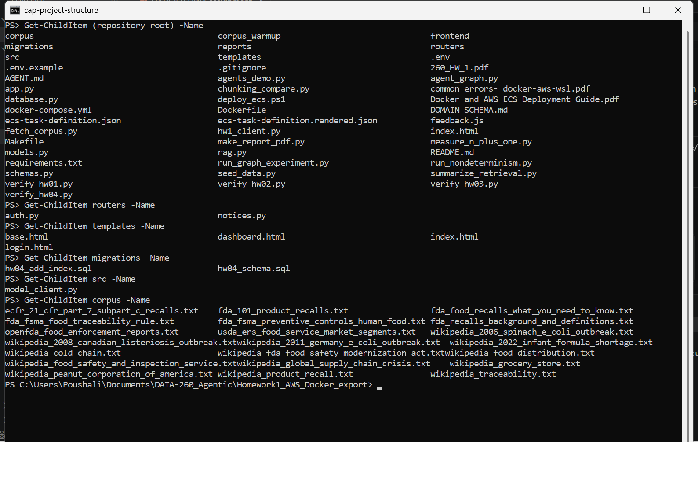

## Part 1: React client

The client is a Vite project in `frontend/` (`npm install`, `npm run dev`, <http://localhost:5173>). It talks to the FastAPI backend on port 8571 through one axios instance with `withCredentials: true`, so the browser sends the HTTP-only `session_id` cookie with every request:

```js
const api = axios.create({
  baseURL: "http://localhost:8571",
  withCredentials: true,
});

export async function login(email, password) {
  const res = await api.post("/auth/login", { email, password });
  return res.data;
}

export async function fetchNotices() {
  const res = await api.get("/api/notices");
  return res.data;
}
```

`App.jsx` owns the state (`user`, `notices`), checks the cookie session once on load with `GET /auth/me`, loads the list whenever a user is logged in, and passes the three handlers down as props. Every handler calls the backend, updates the state and redirects to the home page with `useNavigate`:

```jsx
export default function App() {
  const navigate = useNavigate();
  const [user, setUser] = useState(null);
  const [notices, setNotices] = useState([]);

  useEffect(() => {
    me().then(setUser).catch(() => setUser(null));
  }, []);

  useEffect(() => {
    if (user) {
      fetchNotices().then(setNotices);
    } else {
      setNotices([]);
    }
  }, [user]);

  async function addNotice(data) {
    const created = await createNotice(data);
    setNotices([...notices, created]);
    navigate("/");
  }

  async function editNotice(id, data) {
    const updated = await updateNotice(id, data);
    setNotices(notices.map((n) => (n.id === id ? updated : n)));
    navigate("/");
  }

  async function removeNotice(id) {
    await deleteNotice(id);
    setNotices(notices.filter((n) => n.id !== id));
    navigate("/");
  }

  return (
    <div className="container">
      <Navbar user={user} onLogout={handleLogout} />
      <Routes>
        <Route path="/" element={<Home user={user} notices={notices} />} />
        <Route path="/login" element={<Login onLogin={setUser} />} />
        <Route path="/create" element={<CreateRecord user={user} onAdd={addNotice} />} />
        <Route path="/update/:id" element={<UpdateRecord user={user} onUpdate={editNotice} />} />
        <Route path="/delete/:id" element={<DeleteRecord user={user} onDelete={removeNotice} />} />
      </Routes>
    </div>
  );
}
```

### Login page (Login.jsx)

The form posts email and password to `POST /auth/login`. On success the backend answers with the user and sets the cookie; the component stores the user through the `onLogin` prop and navigates to `/`. A wrong password shows the error text.

```jsx
export default function Login({ onLogin }) {
  const navigate = useNavigate();
  const [email, setEmail] = useState("");
  const [password, setPassword] = useState("");
  const [error, setError] = useState("");

  async function handleSubmit(e) {
    e.preventDefault();
    try {
      const user = await login(email, password);
      onLogin(user);
      navigate("/");
    } catch {
      setError("Invalid email or password");
    }
  }
  ...
}
```

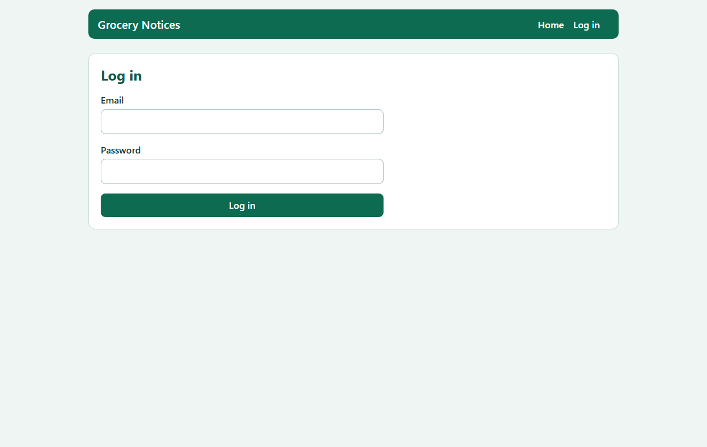

Login page after a wrong password:

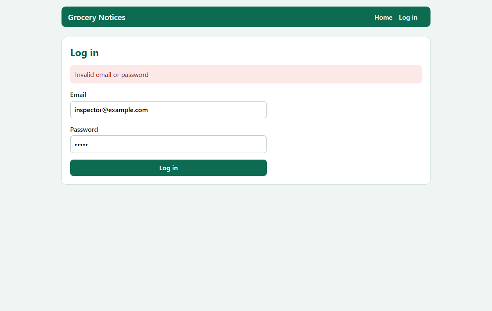

Only logged-in users see the list and the CRUD pages. `Navbar.jsx` hides the "Add notice" link while logged out, and `Home`, `CreateRecord`, `UpdateRecord` and `DeleteRecord` all return a "Login required" message when the `user` prop is null. The backend rejects the same routes with 401 anyway, so the guard is not only in the client.

```jsx
{user ? (
  <>
    <NavLink to="/create">Add notice</NavLink>
    <span className="user">{user.name}</span>
    <button type="button" onClick={onLogout}>Log out</button>
  </>
) : (
  <NavLink to="/login">Log in</NavLink>
)}
```

Home page while logged out ("Login required", no Add button):

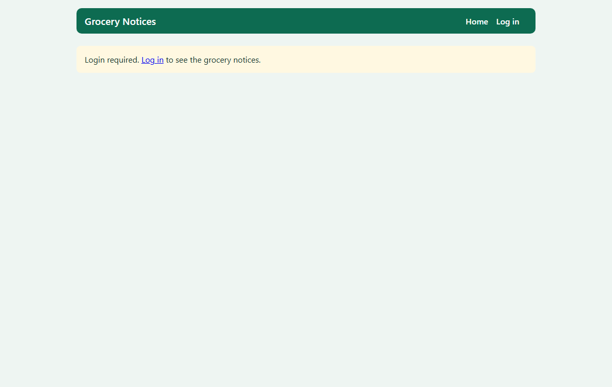

The cookie set by the login as seen in the browser (DevTools, Application, Cookies): only the opaque token, flagged HttpOnly:


### I. Home page (Home.jsx, route /)

Renders every record in a table with an Update and a Delete link per row.

```jsx
export default function Home({ user, notices }) {
  if (!user) {
    return (
      <p className="notice">
        Login required. <Link to="/login">Log in</Link> to see the grocery notices.
      </p>
    );
  }

  return (
    <div className="card">
      <div className="card-header">
        <h2>Grocery notices ({notices.length})</h2>
        <Link className="button" to="/create">Add notice</Link>
      </div>
      <table>
        <thead>
          <tr><th>ID</th><th>Product name</th><th>Source or manufacturer</th><th>Actions</th></tr>
        </thead>
        <tbody>
          {notices.map((notice) => (
            <tr key={notice.id}>
              <td>{notice.id}</td>
              <td>{notice.productName}</td>
              <td>{notice.noticeSource}</td>
              <td>
                <Link to={`/update/${notice.id}`}>Update</Link>
                <Link className="danger" to={`/delete/${notice.id}`}>Delete</Link>
              </td>
            </tr>
          ))}
        </tbody>
      </table>
    </div>
  );
}
```

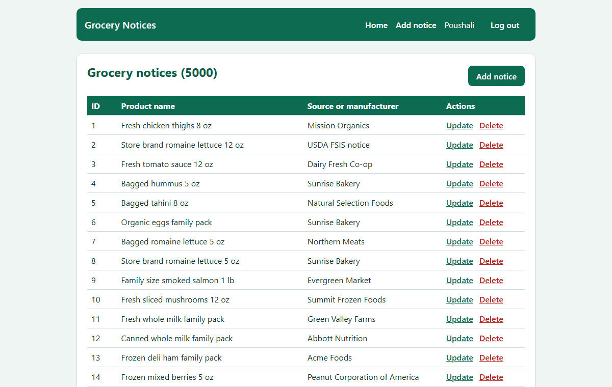

### II. Add a new record (CreateRecord.jsx, route /create)

Two inputs (product name, the primary field; source or manufacturer, the secondary field) and an "Add notice" button. Submitting calls the `onAdd` prop; the backend inserts the row, MySQL assigns the auto-increment id, and `App` appends the returned record and redirects to `/`.

```jsx
export default function CreateRecord({ user, onAdd }) {
  const [productName, setProductName] = useState("");
  const [noticeSource, setNoticeSource] = useState("");

  if (!user) {
    return <p className="notice">Login required</p>;
  }

  function handleSubmit(e) {
    e.preventDefault();
    onAdd({ productName, noticeSource });
  }

  return (
    <div className="card">
      <h2>Add a grocery notice</h2>
      <form onSubmit={handleSubmit}>
        <label>
          Product name
          <input value={productName} onChange={(e) => setProductName(e.target.value)} required />
        </label>
        <label>
          Source or manufacturer
          <input value={noticeSource} onChange={(e) => setNoticeSource(e.target.value)} required />
        </label>
        <button type="submit">Add notice</button>
      </form>
    </div>
  );
}
```

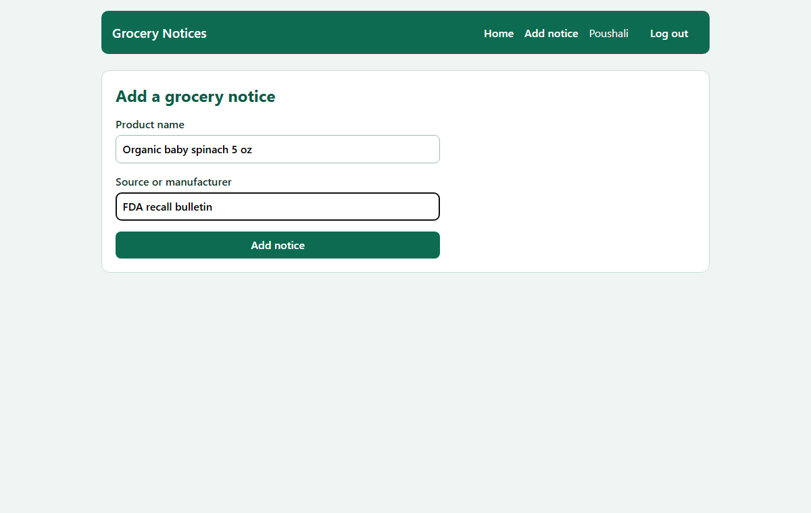

Home page after the submit, with the new record and its id at the end of the list:

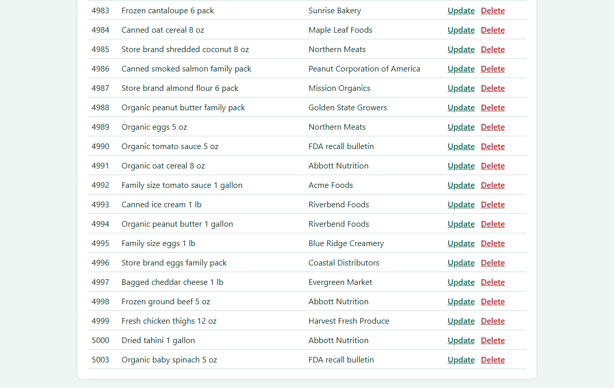

### III. Update record (UpdateRecord.jsx, route /update/:id)

`useParams` gives the id, `useEffect` loads the current values from `GET /api/notices/{id}` into the two inputs, and the "Update notice" button calls the `onUpdate` prop, which sends `PUT /api/notices/{id}` and redirects home.

```jsx
export default function UpdateRecord({ user, onUpdate }) {
  const { id } = useParams();
  const noticeId = Number(id);
  const [productName, setProductName] = useState("");
  const [noticeSource, setNoticeSource] = useState("");

  useEffect(() => {
    if (user) {
      fetchNotice(noticeId).then((notice) => {
        setProductName(notice.productName);
        setNoticeSource(notice.noticeSource);
      });
    }
  }, [user, noticeId]);

  if (!user) {
    return <p className="notice">Login required</p>;
  }

  function handleSubmit(e) {
    e.preventDefault();
    onUpdate(noticeId, { productName, noticeSource });
  }
  ...
}
```

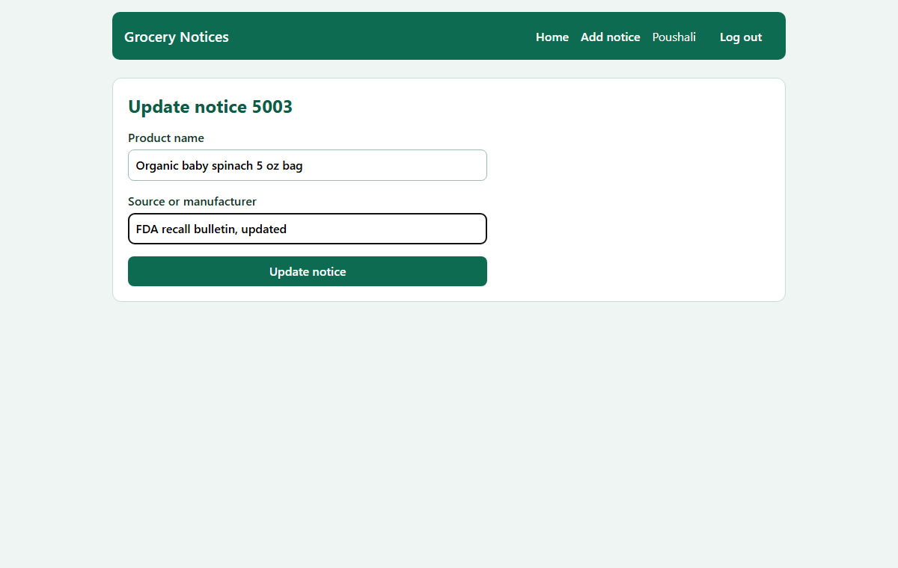

Home page after the update:

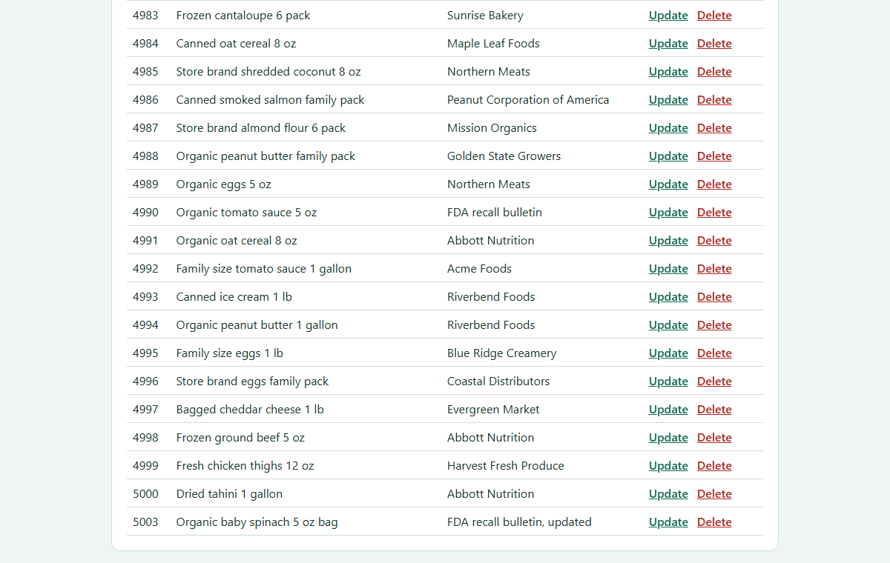

### IV. Delete the record (DeleteRecord.jsx, route /delete/:id)

Loads the record to show what is about to be deleted; the "Delete notice" button calls the `onDelete` prop, which sends `DELETE /api/notices/{id}` and redirects home.

```jsx
export default function DeleteRecord({ user, onDelete }) {
  const { id } = useParams();
  const noticeId = Number(id);
  const [notice, setNotice] = useState(null);

  useEffect(() => {
    if (user) {
      fetchNotice(noticeId).then(setNotice).catch(() => setNotice(null));
    }
  }, [user, noticeId]);

  if (!user) {
    return <p className="notice">Login required</p>;
  }

  return (
    <div className="card">
      <h2>Delete notice {noticeId}</h2>
      {notice ? (
        <>
          <p>Delete <strong>{notice.productName}</strong> from {notice.noticeSource}?</p>
          <button type="button" className="danger" onClick={() => onDelete(noticeId)}>
            Delete notice
          </button>
        </>
      ) : (
        <p className="notice">Notice not found.</p>
      )}
    </div>
  );
}
```

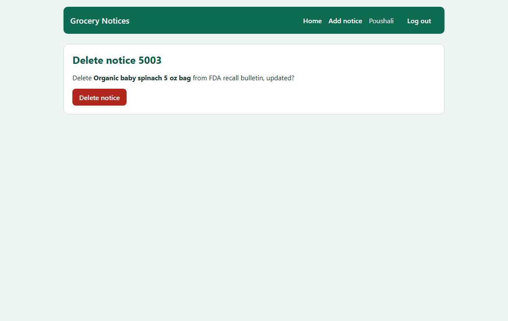

Home page after the delete:

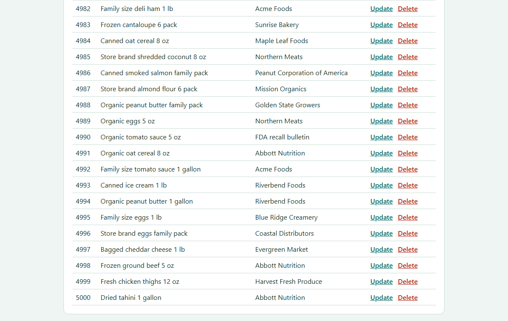

### V. Props, hooks and routing

Create, Update and Delete receive their handler (`onAdd`, `onUpdate`, `onDelete`) and the `user` as props from `App`; `Home` receives `user` and `notices`; `Login` receives `onLogin`. `useState` holds the form values and the loaded record, `useEffect` runs the session check, the list load and the record load for the update and delete pages. Routing is `react-router-dom` 6: `BrowserRouter` in `main.jsx`, `Routes`/`Route` in `App.jsx`, `Link`/`NavLink` in the pages, `useParams` for the id and `useNavigate` for the redirects.

## Part 2: MySQL persistence and server-side sessions

### Database

Database `s0571_rel` (PREFIX `s0571` plus `_rel`) with four tables. `seed_data.py` creates the database if needed and the tables from the SQLAlchemy models; the resulting DDL is committed as `migrations/hw04_schema.sql`:

```sql
CREATE DATABASE IF NOT EXISTS s0571_rel;
USE s0571_rel;

CREATE TABLE `grocery_notices` (
  `id` int NOT NULL AUTO_INCREMENT,
  `product_name` varchar(200) NOT NULL,
  `notice_source` varchar(200) NOT NULL,
  PRIMARY KEY (`id`)
) ENGINE=InnoDB DEFAULT CHARSET=utf8mb4 COLLATE=utf8mb4_0900_ai_ci;
CREATE TABLE `notice_lots` (
  `id` int NOT NULL AUTO_INCREMENT,
  `notice_id` int NOT NULL,
  `lot_code` varchar(50) NOT NULL,
  `units_affected` int NOT NULL,
  PRIMARY KEY (`id`),
  KEY `notice_id` (`notice_id`),
  CONSTRAINT `notice_lots_ibfk_1` FOREIGN KEY (`notice_id`) REFERENCES `grocery_notices` (`id`) ON DELETE CASCADE
) ENGINE=InnoDB DEFAULT CHARSET=utf8mb4 COLLATE=utf8mb4_0900_ai_ci;
CREATE TABLE `sessions` (
  `id` varchar(64) NOT NULL,
  `user_id` int NOT NULL,
  `created_at` datetime NOT NULL,
  `expires_at` datetime NOT NULL,
  PRIMARY KEY (`id`),
  KEY `user_id` (`user_id`),
  CONSTRAINT `sessions_ibfk_1` FOREIGN KEY (`user_id`) REFERENCES `users` (`id`) ON DELETE CASCADE
) ENGINE=InnoDB DEFAULT CHARSET=utf8mb4 COLLATE=utf8mb4_0900_ai_ci;
CREATE TABLE `users` (
  `id` int NOT NULL AUTO_INCREMENT,
  `name` varchar(100) NOT NULL,
  `email` varchar(255) NOT NULL,
  `password_hash` varchar(255) NOT NULL,
  PRIMARY KEY (`id`),
  UNIQUE KEY `email` (`email`)
) ENGINE=InnoDB DEFAULT CHARSET=utf8mb4 COLLATE=utf8mb4_0900_ai_ci;
```

`grocery_notices` is the primary domain entity (auto-increment id, primary field `product_name`, secondary field `notice_source`); `notice_lots` is the related test data for Part 3; `users` and `sessions` are the authentication tables asked for.

`database.py` reads `DATABASE_URL` from `.env` (`.env.example` shows the format) and defines the connection variable `db_session_basede26`:

```python
load_dotenv()

DATABASE_URL = os.getenv("DATABASE_URL")
if not DATABASE_URL:
    raise RuntimeError("DATABASE_URL is missing. Copy .env.example to .env and fill in the MySQL password.")

engine = create_engine(DATABASE_URL, pool_pre_ping=True)
db_session_basede26 = sessionmaker(bind=engine, autoflush=False, expire_on_commit=False)
Base = declarative_base()


def get_db():
    db = db_session_basede26()
    try:
        yield db
    finally:
        db.close()
```

`models.py`:

```python
class GroceryNotice(Base):
    __tablename__ = "grocery_notices"

    id = Column(Integer, primary_key=True, autoincrement=True)
    productName = Column("product_name", String(200), nullable=False)
    noticeSource = Column("notice_source", String(200), nullable=False)
    lots = relationship("NoticeLot", cascade="all, delete-orphan")


class NoticeLot(Base):
    __tablename__ = "notice_lots"

    id = Column(Integer, primary_key=True, autoincrement=True)
    notice_id = Column(Integer, ForeignKey("grocery_notices.id", ondelete="CASCADE"), nullable=False)
    lotCode = Column("lot_code", String(50), nullable=False)
    unitsAffected = Column("units_affected", Integer, nullable=False)


class User(Base):
    __tablename__ = "users"

    id = Column(Integer, primary_key=True, autoincrement=True)
    name = Column(String(100), nullable=False)
    email = Column(String(255), nullable=False, unique=True)
    password_hash = Column(String(255), nullable=False)


class UserSession(Base):
    __tablename__ = "sessions"

    id = Column(String(64), primary_key=True)
    user_id = Column(Integer, ForeignKey("users.id", ondelete="CASCADE"), nullable=False)
    created_at = Column(DateTime, nullable=False, default=datetime.now)
    expires_at = Column(DateTime, nullable=False)
    user = relationship("User", lazy="joined")
```

Database in MySQL Workbench (schema `s0571_rel`, the four tables, 5,000 notices, 200 lots, 2 users):


```
$ mysql ... -e "SHOW TABLES; SELECT COUNT(*) AS notices FROM grocery_notices; SELECT COUNT(*) AS lots FROM notice_lots; SELECT COUNT(*) AS users FROM users; ..."
Tables_in_s0571_rel
grocery_notices
notice_lots
sessions
users
notices
5000
lots
200
users
2
id      product_name                notice_source
5000    Dried tahini 1 gallon       Abbott Nutrition
4999    Fresh chicken thighs 12 oz  Harvest Fresh Produce
4998    Frozen ground beef 5 oz     Abbott Nutrition
id      notice_id  lot_code    units_affected
1       4896       LOT-977337  3043
2       4889       LOT-413239  221
3       4991       LOT-926251  4635
id      name           email
1       Poushali       inspector@example.com
2       Store Manager  manager@example.com
```

### Server-side sessions

Passwords are stored as PBKDF2-SHA256 hashes with a random salt. A successful login inserts a row into `sessions` whose id is a random 64-character token and sets that token, and nothing else, in an HTTP-only cookie. Every protected route reads the cookie, looks the token up in the table, checks `expires_at`, and gets the user from the row; logout deletes the row and clears the cookie, so a copied cookie is useless afterwards (`routers/auth.py`):

```python
def open_session(db: Session, user: User, response: Response):
    token = secrets.token_hex(32)
    now = datetime.now()
    expires = now + timedelta(minutes=SESSION_MINUTES)
    db.add(UserSession(id=token, user_id=user.id, created_at=now, expires_at=expires))
    db.commit()
    response.set_cookie(COOKIE, token, httponly=True, samesite="lax", max_age=SESSION_MINUTES * 60)


def close_session(db: Session, request: Request, response: Response):
    token = request.cookies.get(COOKIE)
    if token:
        db.query(UserSession).filter(UserSession.id == token).delete()
        db.commit()
    response.delete_cookie(COOKIE)


def current_user(request: Request, db: Session = Depends(get_db)):
    token = request.cookies.get(COOKIE)
    if not token:
        return None
    session = db.get(UserSession, token)
    if session is None:
        return None
    if session.expires_at < datetime.now():
        db.delete(session)
        db.commit()
        return None
    return session.user


def require_login(user=Depends(current_user)):
    if user is None:
        raise HTTPException(status_code=401, detail="Login required")
    return user


@router.post("/auth/login", response_model=UserOut)
def login(data: LoginIn, response: Response, db: Session = Depends(get_db)):
    user = find_user(db, data.email, data.password)
    if user is None:
        raise HTTPException(status_code=401, detail="Invalid email or password")
    open_session(db, user, response)
    return user
```

The curl transcript from `RUN_LOG.txt` shows the cookie and the matching row in the table:

```
$ curl -i -s -c cookies.txt -X POST -H "Content-Type: application/json" -d "{\"email\":\"inspector@example.com\",\"password\":\"recall2026\"}" http://127.0.0.1:8571/auth/login
HTTP/1.1 200 OK
set-cookie: session_id=38d14aac31fc093848d08f915610bc07a5ad1a11019e76868e5db6765fde92e8; HttpOnly; Max-Age=1800; Path=/; SameSite=lax

{"id":1,"name":"Poushali","email":"inspector@example.com"}

$ docker exec s0571-mysql mysql -uroot -p... s0571_rel -e "SELECT id, user_id, created_at, expires_at FROM sessions"
id                                                                  user_id  created_at           expires_at
38d14aac31fc093848d08f915610bc07a5ad1a11019e76868e5db6765fde92e8    1        2026-09-23 18:21:08  2026-09-23 18:51:08

$ curl -i -s -b cookies.txt -X POST http://127.0.0.1:8571/auth/logout
HTTP/1.1 200 OK
set-cookie: session_id=""; expires=Thu, 24 Sep 2026 01:21:09 GMT; Max-Age=0; Path=/; SameSite=lax

$ curl -i -s -b cookies.txt http://127.0.0.1:8571/auth/me   (same cookie after logout)
HTTP/1.1 401 Unauthorized
{"detail":"Login required"}
```

### CRUD endpoints

All five operations are in `routers/notices.py`; the router-level dependency makes every one of them require the cookie session.

```python
router = APIRouter(prefix="/api/notices", dependencies=[Depends(require_login)])


def find_notice(db: Session, notice_id: int) -> GroceryNotice:
    notice = db.get(GroceryNotice, notice_id)
    if notice is None:
        raise HTTPException(status_code=404, detail="Notice not found")
    return notice


@router.get("", response_model=list[NoticeOut])
def list_notices(q: str = "", db: Session = Depends(get_db)):
    query = db.query(GroceryNotice)
    if q.strip():
        term = q.strip()
        query = query.filter(GroceryNotice.productName.contains(term) | GroceryNotice.noticeSource.contains(term))
    return query.order_by(GroceryNotice.id).all()


@router.get("/{notice_id}", response_model=NoticeOut)
def get_notice(notice_id: int, db: Session = Depends(get_db)):
    return find_notice(db, notice_id)


@router.post("", response_model=NoticeOut, status_code=201)
def create_notice(data: NoticeIn, db: Session = Depends(get_db)):
    notice = GroceryNotice(**data.model_dump())
    db.add(notice)
    db.commit()
    db.refresh(notice)
    return notice


@router.put("/{notice_id}", response_model=NoticeOut)
def update_notice(notice_id: int, data: NoticeIn, db: Session = Depends(get_db)):
    notice = find_notice(db, notice_id)
    notice.productName = data.productName
    notice.noticeSource = data.noticeSource
    db.commit()
    db.refresh(notice)
    return notice


@router.delete("/{notice_id}", status_code=204)
def delete_notice(notice_id: int, db: Session = Depends(get_db)):
    db.delete(find_notice(db, notice_id))
    db.commit()
```

| Operation | Method and path | Postman screenshot |
|---|---|---|
| Log in (sets the cookie) | `POST /auth/login` | `postman-login.png` |
| Add a new record | `POST /api/notices` | `postman-create.png` |
| View all records | `GET /api/notices` | `postman-list.png` |
| View a record by id | `GET /api/notices/{id}` | `postman-get-by-id.png` |
| Update record details | `PUT /api/notices/{id}` | `postman-update.png` |
| Delete a record | `DELETE /api/notices/{id}` | `postman-delete.png` |
| Without the cookie | `GET /api/notices` | `postman-unauthorized.png` |


The same round trip recorded with curl (`RUN_LOG.txt`):

```
$ curl -i -s -b cookies.txt -X POST -H "Content-Type: application/json" -d "{\"productName\":\"Organic baby spinach 5 oz\",\"noticeSource\":\"FDA recall bulletin\"}" http://127.0.0.1:8571/api/notices
HTTP/1.1 201 Created
{"productName":"Organic baby spinach 5 oz","noticeSource":"FDA recall bulletin","id":5001}

$ curl -s -b cookies.txt http://127.0.0.1:8571/api/notices/5001
{"productName":"Organic baby spinach 5 oz","noticeSource":"FDA recall bulletin","id":5001}

$ curl -s -b cookies.txt -X PUT -H "Content-Type: application/json" -d "{\"productName\":\"Organic baby spinach 5 oz bag\",\"noticeSource\":\"FDA recall bulletin, updated\"}" http://127.0.0.1:8571/api/notices/5001
{"productName":"Organic baby spinach 5 oz bag","noticeSource":"FDA recall bulletin, updated","id":5001}

$ curl -i -s -b cookies.txt -X DELETE http://127.0.0.1:8571/api/notices/5001
HTTP/1.1 204 No Content

$ curl -i -s -b cookies.txt http://127.0.0.1:8571/api/notices/5001
HTTP/1.1 404 Not Found
{"detail":"Notice not found"}
```

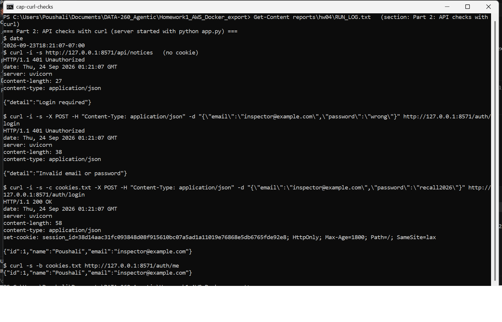

## Part 3: N+1 measurement and query tuning

### 1 and 2. Seed data and the related table

`seed_data.py` seeds `random` with SEED 571, drops and recreates the tables, inserts the two accounts, 5,000 notices built from word lists (form, product, size, source) and 200 lots. Each lot belongs to one of the 200 newest notices, so the pages returned by the list endpoints (newest first) carry related data: a page of 10 has 9 lots, a page of 50 has 56, a page of 200 has all 200.

```python
SEED = 571
NOTICE_COUNT = 5000
LOT_COUNT = 200


def main():
    random.seed(SEED)
    create_database()
    Base.metadata.drop_all(bind=engine)
    Base.metadata.create_all(bind=engine)

    db = db_session_basede26()
    db.add_all([User(name=name, email=email, password_hash=hash_password(password)) for name, email, password in USERS])
    notices = []
    for _ in range(NOTICE_COUNT):
        product = f"{random.choice(FORMS)} {random.choice(PRODUCTS)} {random.choice(SIZES)}"
        notices.append(GroceryNotice(productName=product, noticeSource=random.choice(SOURCES)))
    db.add_all(notices)
    db.commit()

    lots = []
    for _ in range(LOT_COUNT):
        lots.append(NoticeLot(
            notice_id=random.randint(NOTICE_COUNT - 199, NOTICE_COUNT),
            lotCode=f"LOT-{random.randint(100000, 999999)}",
            unitsAffected=random.randint(10, 5000),
        ))
    db.add_all(lots)
    db.commit()
```

```
$ date
2026-09-23T18:18:37-07:00
$ python seed_data.py
seed 571: 2 users, 5000 notices, 200 lots
$ date
2026-09-23T18:18:57-07:00
```

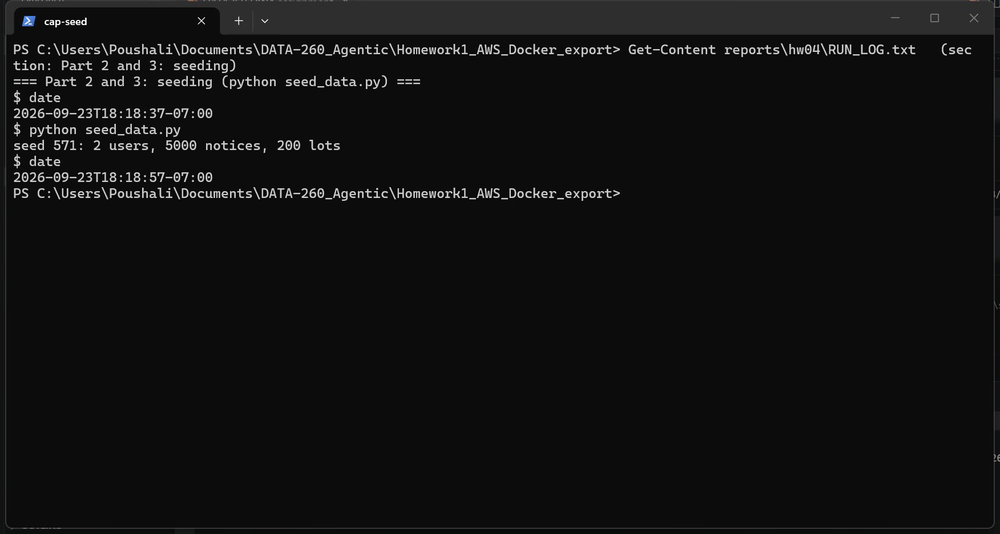

### 3 and 5. The naive endpoint and the fixed endpoint

Both endpoints return the same page (`page_size` newest notices, each with its `lots`) and the number of SQL statements the endpoint body issued. The count comes from a `before_cursor_execute` listener on the engine that increments a per-request counter kept in a `ContextVar` (`database.py`):

```python
query_counter = ContextVar("query_counter", default=None)


@event.listens_for(engine, "before_cursor_execute")
def count_query(conn, cursor, statement, parameters, context, executemany):
    counter = query_counter.get()
    if counter is not None:
        counter[0] += 1


def start_counting():
    query_counter.set([0])


def queries_so_far():
    return query_counter.get()[0]
```

The naive version loads the notices and then lets `NoticeWithLots.model_validate` read `notice.lots` for each one; the relationship is lazy, so every access is one more `SELECT ... FROM notice_lots WHERE notice_id = %s`. The fixed version adds `selectinload`, which loads all lots of the page in one `WHERE notice_id IN (...)` statement:

```python
@router.get("/naive", response_model=NoticePage)
def list_naive(page_size: int = 10, db: Session = Depends(get_db)):
    start_counting()
    notices = db.query(GroceryNotice).order_by(GroceryNotice.id.desc()).limit(page_size).all()
    items = [NoticeWithLots.model_validate(notice) for notice in notices]
    return NoticePage(version="naive", page_size=page_size, sql_queries=queries_so_far(), notices=items)


@router.get("/fixed", response_model=NoticePage)
def list_fixed(page_size: int = 10, db: Session = Depends(get_db)):
    start_counting()
    notices = (
        db.query(GroceryNotice)
        .options(selectinload(GroceryNotice.lots))
        .order_by(GroceryNotice.id.desc())
        .limit(page_size)
        .all()
    )
    items = [NoticeWithLots.model_validate(notice) for notice in notices]
    return NoticePage(version="fixed", page_size=page_size, sql_queries=queries_so_far(), notices=items)
```

The MySQL general log confirms the counts for one request of each version at page size 10 (`RUN_LOG.txt`): the naive request produced one `SELECT ... grocery_notices` and ten `SELECT ... notice_lots ... WHERE notice_id = %s`, the fixed request one notices query and one `notice_lots ... IN (...)` query. Every protected route also runs one `SELECT sessions` for the login check before the endpoint body; that statement is outside the reported count.

```
$ mysql ... -e "SELECT LEFT(argument, 22) AS statement_start, COUNT(*) AS statements FROM mysql.general_log WHERE ... GROUP BY 1"
statement_start         statements
SELECT users.id AS use  1
SELECT sessions.id AS   2
SELECT grocery_notices  2
SELECT notice_lots.id   10
SELECT notice_lots.not  1
```

### 4, 5 and 6. Measurements

`measure_n_plus_one.py` logs in, sends 2 warm-up requests and then 30 measured requests for each of the six combinations, and stores every request (page size, version, request number, statement count, notices and lots returned, latency in ms, timestamp) in `raw/n_plus_one_requests.csv` (180 rows). The percentiles are computed with `numpy.percentile` and written to `raw/n_plus_one_summary.json`.

```python
def timed_get(session, version, page_size):
    start = time.perf_counter()
    response = session.get(f"{BASE_URL}/api/notices/{version}", params={"page_size": page_size})
    latency_ms = (time.perf_counter() - start) * 1000
    response.raise_for_status()
    return response.json(), latency_ms


def main():
    session = requests.Session()
    session.post(f"{BASE_URL}/auth/login", json=LOGIN).raise_for_status()

    rows = []
    for page_size in PAGE_SIZES:
        for version in VERSIONS:
            for _ in range(WARMUP):
                timed_get(session, version, page_size)
            for number in range(1, REQUESTS_PER_CASE + 1):
                body, latency_ms = timed_get(session, version, page_size)
                rows.append({
                    "page_size": page_size,
                    "version": version,
                    "request": number,
                    "sql_queries": body["sql_queries"],
                    "notices_returned": len(body["notices"]),
                    "lots_returned": sum(len(notice["lots"]) for notice in body["notices"]),
                    "latency_ms": round(latency_ms, 3),
                    "timestamp": datetime.now().isoformat(timespec="milliseconds"),
                })
```

```
$ date
2026-09-23T18:22:18-07:00
$ python measure_n_plus_one.py
page_size=10 naive: 30 requests done, sql_queries=11
page_size=10 fixed: 30 requests done, sql_queries=2
page_size=50 naive: 30 requests done, sql_queries=51
page_size=50 fixed: 30 requests done, sql_queries=2
page_size=200 naive: 30 requests done, sql_queries=201
page_size=200 fixed: 30 requests done, sql_queries=2

| Page size | Version | SQL stmts/req | p50 (ms) | p95 (ms) | p99 (ms) |
|---|---|---|---|---|---|
| 10 | naive | 11 | 23.76 | 29.21 | 72.06 |
| 10 | fixed | 2 | 10.12 | 12.04 | 12.81 |
| 50 | naive | 51 | 92.52 | 149.12 | 160.95 |
| 50 | fixed | 2 | 13.69 | 19.28 | 19.65 |
| 200 | naive | 201 | 647.48 | 870.04 | 1050.93 |
| 200 | fixed | 2 | 32.29 | 61.64 | 81.7 |

page_size=10: fixed is 2.35x faster at p50 (13.64 ms saved per request)
page_size=50: fixed is 6.76x faster at p50 (78.83 ms saved per request)
page_size=200: fixed is 20.05x faster at p50 (615.19 ms saved per request)
wrote ...\reports\hw04\raw\n_plus_one_requests.csv (180 rows) and n_plus_one_summary.json
$ date
2026-09-23T18:22:45-07:00
```

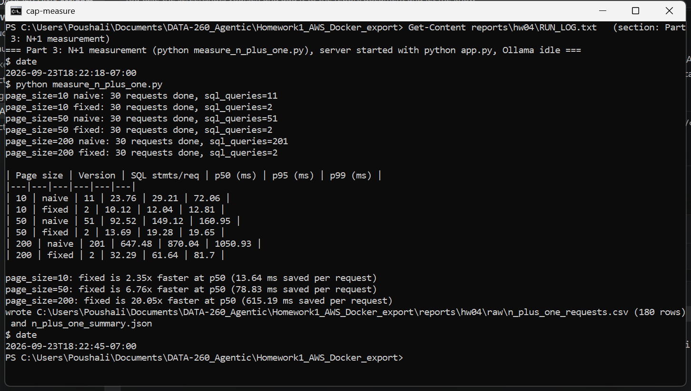

| Page size | Version | SQL stmts/req | p50 (ms) | p95 (ms) | p99 (ms) |
|---|---|---|---|---|---|
| 10 | naive | 11 | 23.76 | 29.21 | 72.06 |
| 10 | fixed | 2 | 10.12 | 12.04 | 12.81 |
| 50 | naive | 51 | 92.52 | 149.12 | 160.95 |
| 50 | fixed | 2 | 13.69 | 19.28 | 19.65 |
| 200 | naive | 201 | 647.48 | 870.04 | 1050.93 |
| 200 | fixed | 2 | 32.29 | 61.64 | 81.70 |

### 7. How much faster the fixed version is, and why the speed-up grows

| Page size | Statements removed | p50 naive / fixed | p95 naive / fixed | ms saved per request (p50) |
|---|---|---|---|---|
| 10 | 9 | 2.35x | 2.43x | 13.64 |
| 50 | 49 | 6.76x | 7.73x | 78.83 |
| 200 | 199 | 20.05x | 14.12x | 615.19 |

The naive endpoint costs a fixed part plus one round trip per notice: the fixed part (session lookup, the notices query, building the response) is about 10 ms and each extra `notice_lots` statement adds roughly 1.5 ms at page sizes 10 and 50 and about 3 ms at 200, because every statement is a separate network round trip to MySQL (through the Docker port mapping here), a separate parse and execute on the server, and a separate set of ORM objects. The fixed endpoint always runs two statements, and the second one returns all lots of the page at once, so its cost grows only with the rows it returns (10 ms at page size 10, 32 ms at 200). The saving is therefore proportional to the page size while the denominator hardly moves: at 10 rows the fixed part still dominates both versions and the ratio is only 2.4x; at 200 rows the naive version spends almost all of its 650 ms in the 200 extra round trips and the ratio reaches 20x. The p99 of the naive version at page size 10 (72 ms) is one slow request among the 30 (89 ms in the raw file), which is why the p95 column is the fairer comparison of the tails.

### 8. One index, EXPLAIN before and after

The index is on `grocery_notices.notice_source` (`migrations/hw04_add_index.sql`), the column the seeded sources are filtered by; the query is `SELECT id, product_name, notice_source FROM grocery_notices WHERE notice_source = 'FDA recall bulletin' ORDER BY id`.

```sql
CREATE INDEX ix_grocery_notices_notice_source ON grocery_notices (notice_source);
```

Before:

```
$ mysql ... -e "EXPLAIN SELECT id, product_name, notice_source FROM grocery_notices WHERE notice_source = 'FDA recall bulletin' ORDER BY id"
id  select_type  table            partitions  type   possible_keys  key      key_len  ref   rows  filtered  Extra
1   SIMPLE       grocery_notices  NULL        index  NULL           PRIMARY  4        NULL  5158  10.00     Using where

$ mysql ... -e "EXPLAIN ANALYZE ..."
-> Filter: (grocery_notices.notice_source = 'FDA recall bulletin')  (cost=522 rows=516) (actual time=0.0767..2.16 rows=183 loops=1)
    -> Index scan on grocery_notices using PRIMARY  (cost=522 rows=5158) (actual time=0.0396..1.69 rows=5000 loops=1)
```

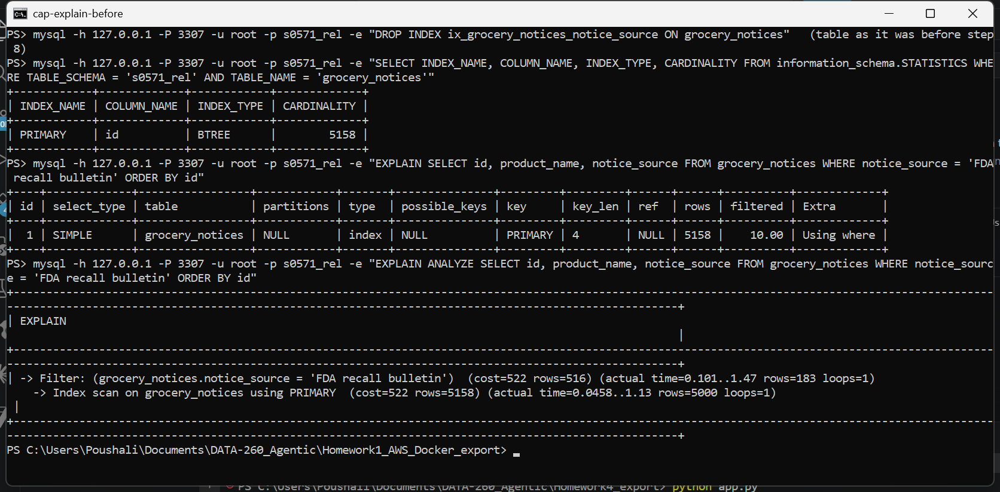

After:

```
$ mysql ... s0571_rel < migrations/hw04_add_index.sql
$ mysql ... -e "EXPLAIN SELECT id, product_name, notice_source FROM grocery_notices WHERE notice_source = 'FDA recall bulletin' ORDER BY id"
id  select_type  table            partitions  type  possible_keys                     key                               key_len  ref    rows  filtered  Extra
1   SIMPLE       grocery_notices  NULL        ref   ix_grocery_notices_notice_source  ix_grocery_notices_notice_source  802      const  183   100.00    NULL

$ mysql ... -e "EXPLAIN ANALYZE ..."
-> Index lookup on grocery_notices using ix_grocery_notices_notice_source (notice_source='FDA recall bulletin')  (cost=37 rows=183) (actual time=0.0887..0.593 rows=183 loops=1)
```

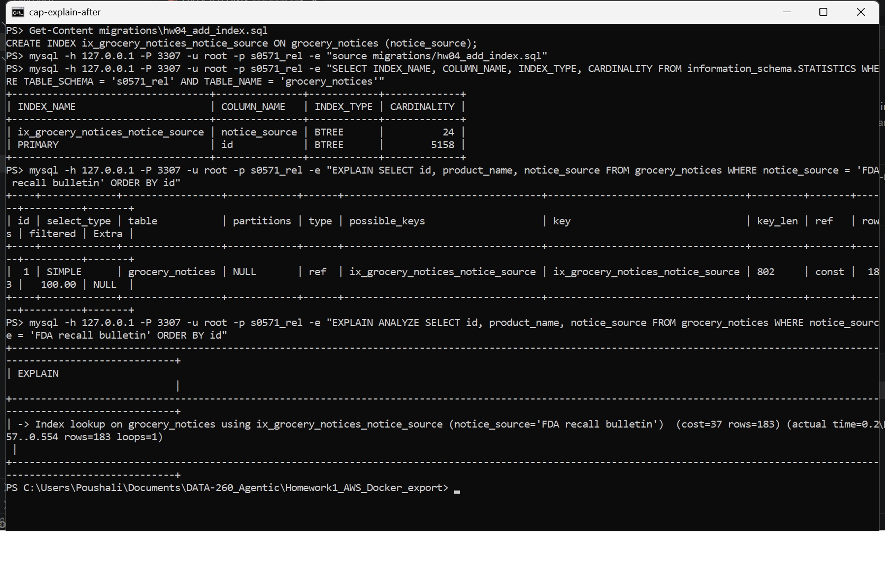

What changed: before the index there was no `possible_keys` entry for the `WHERE` column, so MySQL scanned the whole table (`type=index` over PRIMARY, 5,158 estimated rows, 5,000 actually read) and applied the filter to every row (`Using where`, `filtered=10.00`), keeping 183. After the index the access type is `ref` with `ref=const`: the optimizer looks up `'FDA recall bulletin'` in the B-tree and reads only the 183 matching entries, the row estimate equals the real count, `filtered` is 100 percent, and the `Using where` step is gone. `EXPLAIN ANALYZE` shows the cost estimate dropping from 522 to 37 and the actual time from 2.16 ms to 0.59 ms. `key_len=802` is the 200-character `utf8mb4` column (4 bytes per character plus 2 length bytes). The `ORDER BY id` needs no filesort in either plan: the primary-key scan is already in id order, and an InnoDB secondary index stores the primary key with every entry, so the entries for one source also come out in id order.

### 9. Both versions of the endpoint in Postman at each page size

Each response shows `version`, `page_size`, `sql_queries` and the notices with their `lots`.

| Page size | Naive | Fixed |
|---|---|---|
| 10 | `postman-naive-10.png` (`sql_queries: 11`) | `postman-fixed-10.png` (`sql_queries: 2`) |
| 50 | `postman-naive-50.png` (`sql_queries: 51`) | `postman-fixed-50.png` (`sql_queries: 2`) |
| 200 | `postman-naive-200.png` (`sql_queries: 201`) | `postman-fixed-200.png` (`sql_queries: 2`) |


The same two responses from curl at page size 10 (`RUN_LOG.txt`):

```
$ curl -s -b cookies.txt "http://127.0.0.1:8571/api/notices/naive?page_size=10" | python -c "..."
{'version': 'naive', 'page_size': 10, 'sql_queries': 11} first notice: {'productName': 'Dried tahini 1 gallon', 'noticeSource': 'Abbott Nutrition', 'id': 5000, 'lots': [{'id': 183, 'lotCode': 'LOT-553350', 'unitsAffected': 2298}]}
$ curl -s -b cookies.txt "http://127.0.0.1:8571/api/notices/fixed?page_size=10" | python -c "..."
{'version': 'fixed', 'page_size': 10, 'sql_queries': 2} first notice: {'productName': 'Dried tahini 1 gallon', 'noticeSource': 'Abbott Nutrition', 'id': 5000, 'lots': [{'id': 183, 'lotCode': 'LOT-553350', 'unitsAffected': 2298}]}
```

## Part 4: grounded RAG question answering

Everything is in `rag.py` (`python rag.py`, about 13 minutes on this laptop; `python rag.py --summary` re-evaluates the saved answers and rebuilds the tables). The model is `qwen3:8b` through Ollama with temperature 0, thinking off, `num_ctx` 4096 and at most 200 output tokens, called through `src/model_client.py` from HW1. The retrieved-chunk printouts, the answers, the comparison, the k sweep and the evaluation are saved in `reports/hw04/raw/` (`rag_retrievals.txt`, `rag_results.jsonl`, `rag_comparison.md`, `rag_k_sweep.md`, `rag_evaluation.md`, plus `rag_chunks.jsonl` with every chunk).

### 1. Corpus and index

The corpus is the 21 plain-text documents in `corpus/` collected for HW3 (FDA recall pages, 21 CFR Part 7 Subpart C, the FSMA and Food Traceability Rule pages, openFDA enforcement reports, a USDA page and 13 Wikipedia articles on recalls, outbreaks and food distribution; 393,964 bytes). Each file is split with `RecursiveCharacterTextSplitter(chunk_size=500, chunk_overlap=50)`; every chunk keeps its text, source file name and a running `chunk_id`. The chunks are embedded with `all-MiniLM-L6-v2` (normalised, so the inner product is the cosine similarity) and loaded into a FAISS `IndexFlatIP`.

```python
def load_chunks():
    splitter = RecursiveCharacterTextSplitter(chunk_size=CHUNK_SIZE, chunk_overlap=CHUNK_OVERLAP)
    chunks = []
    for path in sorted(CORPUS.glob("*.txt")):
        for text in splitter.split_text(path.read_text(encoding="utf-8")):
            chunks.append({"chunk_id": len(chunks), "source": path.name, "text": text})
    return chunks


def build_index(chunks, embedder):
    vectors = embedder.encode([chunk["text"] for chunk in chunks], normalize_embeddings=True, batch_size=64)
    index = faiss.IndexFlatIP(vectors.shape[1])
    index.add(np.asarray(vectors, dtype="float32"))
    return index
```

```
$ python rag.py
21 documents, 1158 chunks (chunk_size=500, chunk_overlap=50)
FAISS index built with 1158 vectors of dimension 384
```

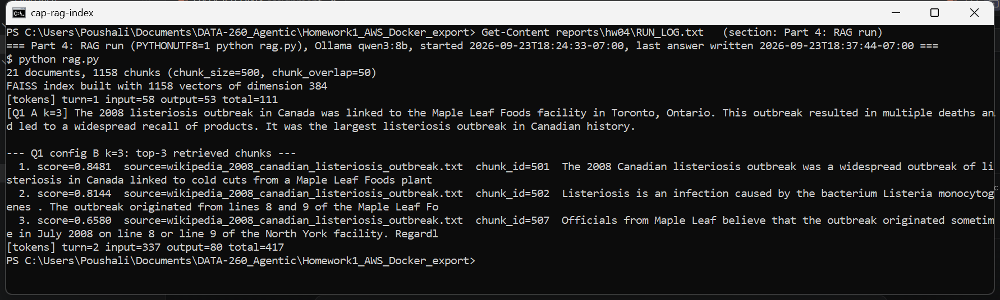

### 2. Retrieval with printed chunks

`retrieve` returns the top-k chunks with their score, and `show_hits` prints rank, score, source, chunk id and the first 140 characters of every chunk before the model is called (and appends the same lines to `raw/rag_retrievals.txt`), so a bad retrieval can be told apart from a bad generation.

```python
def retrieve(question, k, chunks, index, embedder):
    vector = embedder.encode([question], normalize_embeddings=True)
    scores, ids = index.search(np.asarray(vector, dtype="float32"), k)
    return [dict(chunks[i], score=round(float(score), 4)) for score, i in zip(scores[0], ids[0])]


def show_hits(label, hits):
    lines = [f"--- {label}: top-{len(hits)} retrieved chunks ---"]
    for rank, hit in enumerate(hits, 1):
        preview = " ".join(hit["text"].split())[:140]
        lines.append(f"  {rank}. score={hit['score']:.4f}  source={hit['source']}  chunk_id={hit['chunk_id']}  {preview}")
    text = "\n".join(lines)
    print(text)
    with (RAW / "rag_retrievals.txt").open("a", encoding="utf-8") as f:
        f.write(text + "\n\n")
```

Printouts for Q1 (right chunks), Q2 (wrong chunks: all from one document, two of them heading fragments) and Q6 (unrelated question, low scores):

```
--- Q1 config B k=3: top-3 retrieved chunks ---
  1. score=0.8481  source=wikipedia_2008_canadian_listeriosis_outbreak.txt  chunk_id=501  The 2008 Canadian listeriosis outbreak was a widespread outbreak of listeriosis in Canada linked to cold cuts from a Maple Leaf Foods plant
  2. score=0.8144  source=wikipedia_2008_canadian_listeriosis_outbreak.txt  chunk_id=502  Listeriosis is an infection caused by the bacterium Listeria monocytogenes . The outbreak originated from lines 8 and 9 of the Maple Leaf Fo
  3. score=0.6580  source=wikipedia_2008_canadian_listeriosis_outbreak.txt  chunk_id=507  Officials from Maple Leaf believe that the outbreak originated sometime in July 2008 on line 8 or line 9 of the North York facility. Regardl

--- Q2 config B k=3: top-3 retrieved chunks ---
  1. score=0.7282  source=fda_fsma_food_traceability_rule.txt  chunk_id=153  in § 1.1315 of the Food Traceability Rule and reflect the current practices specific to the covered entity.
  2. score=0.7088  source=fda_fsma_food_traceability_rule.txt  chunk_id=95  Getting Started with the Food Traceability Rule
  3. score=0.7071  source=fda_fsma_food_traceability_rule.txt  chunk_id=94  proposed to extend the compliance date for the rule by 30 months to July 20, 2028. Subsequently, the Continuing Appropriations, Agriculture,

--- Q6 config C k=3: top-3 retrieved chunks ---
  1. score=0.3820  source=wikipedia_food_distribution.txt  chunk_id=817  Japan
  2. score=0.2249  source=wikipedia_food_distribution.txt  chunk_id=796  Farm to Table
  3. score=0.2023  source=wikipedia_food_distribution.txt  chunk_id=816  See also
  dropped chunk 796: score 0.2249 below 0.35
  dropped chunk 816: score 0.2023 below 0.35
  context after filtering: [817]
```

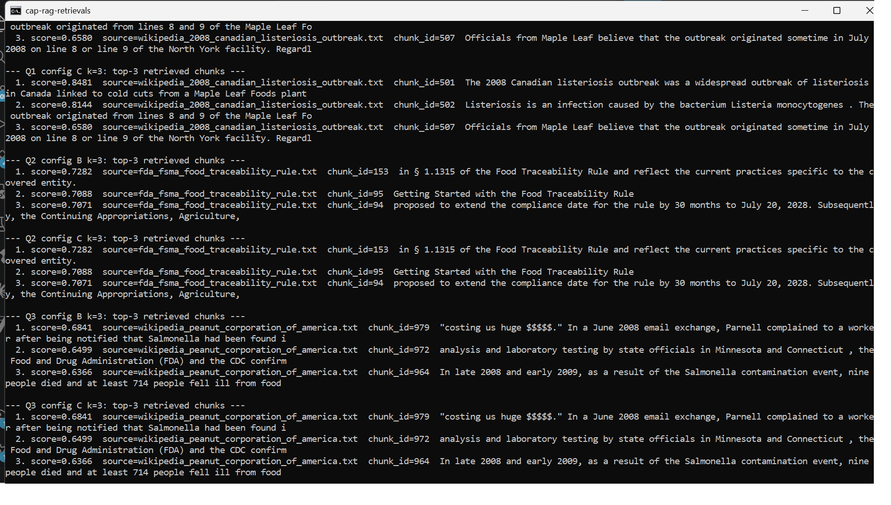

### 3. Three configurations

(A) sends the question alone. (B) puts the three raw chunks in front of the question. (C) drops chunks with a cosine score below 0.35 and chunks whose word set overlaps a kept chunk by more than 60 percent, keeps the survivors in score order, labels each one `[Source n] file, chunk id`, and adds the grounding rules: answer only from the sources, cite the source number, and reply with the exact sentence "I cannot answer this question from the provided documents" when the sources are not enough.

```python
NO_RAG_PROMPT = "You are a helpful assistant. Answer the question in at most three sentences."
BASIC_PROMPT = "Use the context to answer the question in at most three sentences."
CONTEXT_PROMPT = (
    "Answer the question using only the numbered sources below, in at most three sentences. "
    "Cite the source number after each fact, like [Source 2]. "
    f"If the sources do not contain the answer, reply exactly: {REFUSAL}"
)


def engineer_context(hits):
    kept, dropped = [], []
    for hit in hits:
        if hit["score"] < MIN_SCORE:
            dropped.append({"chunk_id": hit["chunk_id"], "reason": f"score {hit['score']:.4f} below {MIN_SCORE}"})
        elif any(overlap(hit["text"], other["text"]) > DUPLICATE_OVERLAP for other in kept):
            dropped.append({"chunk_id": hit["chunk_id"], "reason": "duplicate of a kept chunk"})
        else:
            kept.append(hit)
    return kept, dropped


def basic_prompt(question, hits):
    context = "\n\n".join(hit["text"] for hit in hits)
    return f"Context:\n{context}\n\nQuestion: {question}"


def engineered_prompt(question, kept):
    parts = [f"[Source {i}] {hit['source']}, chunk {hit['chunk_id']}\n{hit['text']}" for i, hit in enumerate(kept, 1)]
    return "Sources:\n\n" + "\n\n".join(parts) + f"\n\nQuestion: {question}"
```

### 4. The six questions

| Id | Kind | Question | Where the answer is |
|---|---|---|---|
| Q1 | answer in one chunk | Which Maple Leaf Foods facility was the source of the 2008 listeriosis outbreak in Canada? | `wikipedia_2008_canadian_listeriosis_outbreak.txt`, chunk 502 ("Bartor Road facility, Establishment No. 97B") |
| Q2 | answer needs two chunks | When was the Food Safety Modernization Act signed into law, and what was the original compliance date of the Food Traceability Rule? | `wikipedia_fda_food_safety_modernization_act.txt` chunk 673 (January 4, 2011) and `fda_fsma_food_traceability_rule.txt` chunk 93 (January 20, 2026) |
| Q3 | similar information across documents | Which company was responsible for the 2008 to 2009 Salmonella outbreak linked to peanut butter, and what happened to the company afterwards? | `wikipedia_peanut_corporation_of_america.txt` (chunks 964, 965, 972) and `wikipedia_product_recall.txt` (chunk 1047) both describe PCA, the recall and the shutdown |
| Q4 | ambiguous | What caused the outbreak? | Five outbreaks in the corpus (spinach 2006, Canada 2008, PCA 2008 to 2009, Germany 2011, formula 2022); the good answer asks which one |
| Q5 | answer not in the documents | What is the FDA's toll-free phone number for reporting a problem with a recalled food? | Not in the corpus (no phone number appears in any file); must be refused |
| Q6 | unrelated | Who won the 2018 FIFA World Cup? | Not in the corpus; must be refused |

Answers of the three configurations (full text in `raw/rag_comparison.md`; "n/a" means not applicable):

| Q | (A) No RAG | (B) Basic RAG, top-3 raw chunks | (C) Context-engineered RAG |
|---|---|---|---|
| Q1 | "linked to the Maple Leaf Foods facility in Toronto, Ontario ... the largest listeriosis outbreak in Canadian history" (no plant named, wrong) | "originated from lines 8 and 9 of the Maple Leaf Foods Bartor Road facility in Toronto, Ontario ... establishment number 97B ... 57 confirmed cases and 23 deaths" (correct) | "the Maple Leaf Foods plant in Toronto, Ontario [Source 1]. Specifically ... lines 8 and 9 of the Maple Leaf Foods Bartor Road facility (Establishment No. 97B) [Source 2]" (correct, cited) |
| Q2 | "signed into law on January 4, 2011 ... original compliance date ... January 1, 2022 ... extended to January 1, 2025" (second half invented) | "signed into law in 2011 ... original compliance date ... July 20, 2026 ... extended to July 20, 2028" (date wrong, not in the chunks) | "I cannot answer this question from the provided documents." (evidence really was missing) |
| Q3 | "Peanut Corporation of America (PCA) ... massive recall and eventual bankruptcy ... Stewart Parnell was convicted" (correct, from memory) | "Peanut Corporation of America (PCA) ... most extensive food recall in U.S. history ... nine deaths and over 700 illnesses ... the company's bankruptcy" (correct, but "bankruptcy" is not in the three chunks) | "Peanut Corporation of America (PCA) ... [Source 2]. ... most extensive food recall in U.S. history ... 46 states, more than 360 companies, more than 3,900 different products [Source 3]" (grounded but the second half of the question is not answered) |
| Q4 | "depends on the specific disease or event in question ... more context is needed about the outbreak being referred to" (asks for clarification, the right reaction) | "likely caused by contaminated spinach ... Most victims became infected in Germany or France" (mixes the 2006 spinach and the 2011 German outbreak into one) | "contaminated food, specifically spinach ... [Source 2] ... infected in Germany or France [Source 3]. The exact cause was not specified in the provided documents." (same mix, hedged, not the exact refusal) |
| Q5 | "1-800-FDA-1040 (1-800-323-1040) ... FDA's Food Emergency Response Team" (invented) | "The context provided does not include the FDA's toll-free phone number ... consumers should visit the FDA's website" (soft refusal) | "I cannot answer this question from the provided documents." |
| Q6 | "France won the 2018 FIFA World Cup, defeating Croatia 4-2 ... after a penalty shootout in extra time" (answered from memory, with an invented detail) | "The 2018 FIFA World Cup was won by France ... defeated Croatia in the final" (ignored the context, answered from memory) | "I cannot answer this question from the provided documents." |

Q5 and Q6 are refused by configuration C with the exact sentence; configuration B refused Q5 softly but answered Q6, and configuration A answered both.

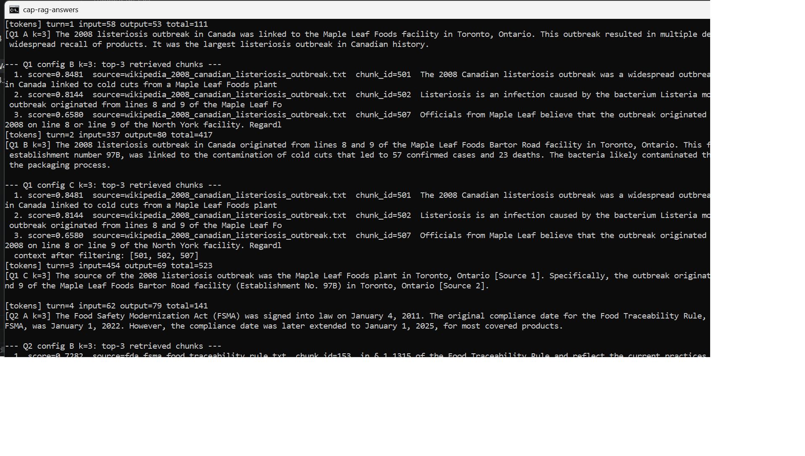

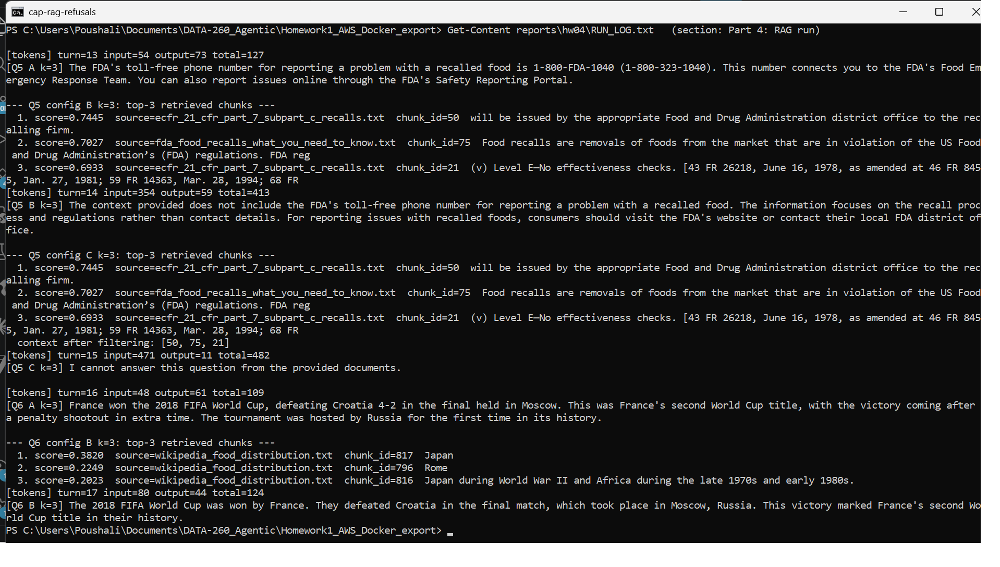

### 5. Context size sweep (Q2 at k = 1, 3, 5, configuration C)

| k | Retrieved (source, chunk, score) | Kept | Answer | Correct | Grounded |
|---|---|---|---|---|---|
| 1 | traceability #153 (0.7282) | 153 | "I cannot answer this question from the provided documents." | no | n/a |
| 3 | traceability #153 (0.7282), #95 (0.7088), #94 (0.7071) | 153, 95, 94 | "signed into law on January 4, 2011 [Source 3]. The original compliance date ... was July 20, 2026, but it was extended to July 20, 2028 [Source 3]." | no | no (Source 3 contains neither date; the compliance date is wrong) |
| 5 | traceability #153, #95, #94, #93 (0.7028), #169 (0.6987) | 153, 95, 94, 93, 169 | "signed into law on January 4, 2011 [Source 3]. The original compliance date of the Food Traceability Rule was January 20, 2026 [Source 4]." | yes | no (January 20, 2026 is in Source 4, but January 4, 2011 is not in Source 3) |

More context helped: k=1 gave one fragment (107 characters about § 1.1315) and the model refused; k=5 finally brought chunk 93 with the compliance date and the answer became correct. Irrelevant chunks appeared at every k: #153 and #95 are a sentence fragment and a heading, and #169 (rank 5) is about a public meeting. The FSMA signing date was never retrieved at any k, because the question embeds close to "Food Traceability Rule" and every hit comes from that page; the model filled that half in from memory and attached a citation to a chunk that does not contain it. k=5 was the best of the three for accuracy, but the extra context did not make the answer more faithful, and the same k=3 prompt produced a refusal in the comparison run and an answer here (temperature 0, identical prompt of 283 tokens), so the k=3 row is also a reminder that the model is not deterministic.

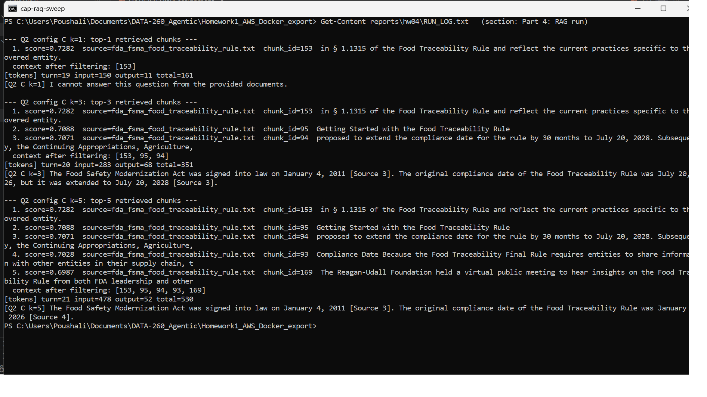

### 6. Evaluation

Correct retrieval means every expected source file is in the top-k. Correct answer means the expected facts are in the answer (Q1: "Bartor Road"; Q2: both dates; Q3: PCA plus what happened to it; Q4: a request to say which outbreak; Q5, Q6: a refusal). Grounded means every expected fact the answer states appears in the chunks it cites (or in all context chunks when nothing is cited); it is n/a for refusals, for configuration A, and for the ambiguous Q4. Refused when needed is yes when the answer refused exactly for Q5 and Q6 and did not refuse otherwise. Format OK means at most three sentences for A and B, and for C a `[Source n]` citation or the exact refusal sentence. The flags are computed by `rag.py` from the saved answers and were checked by hand against the full text.

| Question | Config | Correct retrieval | Correct answer | Grounded | Refused when needed | Format OK |
|---|---|---|---|---|---|---|
| Q1 | A | no | no | n/a | yes | yes |
| Q1 | B | yes | yes | yes | yes | yes |
| Q1 | C | yes | yes | yes | yes | yes |
| Q2 | A | no | no | n/a | yes | yes |
| Q2 | B | no | no | no | yes | yes |
| Q2 | C | no | no | n/a | no | yes |
| Q3 | A | no | yes | n/a | yes | yes |
| Q3 | B | no | yes | no | yes | yes |
| Q3 | C | no | no | yes | yes | yes |
| Q4 | A | n/a | yes | n/a | yes | yes |
| Q4 | B | n/a | no | n/a | yes | yes |
| Q4 | C | n/a | no | n/a | no | no |
| Q5 | A | n/a | no | n/a | no | yes |
| Q5 | B | n/a | yes | n/a | yes | yes |
| Q5 | C | n/a | yes | n/a | yes | yes |
| Q6 | A | n/a | no | n/a | no | yes |
| Q6 | B | n/a | no | no | no | yes |
| Q6 | C | n/a | yes | n/a | yes | yes |

| Config | Accuracy (correct answers / 6) | Faithfulness (grounded / answered with context) | Format compliance | Robustness (Q5, Q6 refused) |
|---|---|---|---|---|
| A, no RAG | 2/6 | n/a (no context) | 6/6 | 0/2 |
| B, basic RAG | 3/6 | 1/4 | 6/6 | 1/2 |
| C, context-engineered RAG | 3/6 | 2/2 | 5/6 | 2/2 |

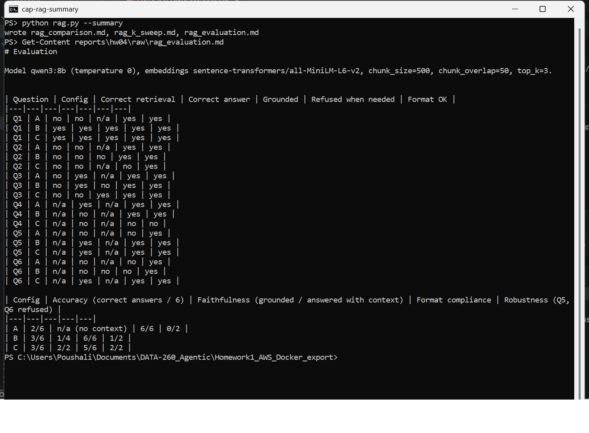

### 7. Analysis

Retrieval worked where the question and the evidence used the same words. Q1's three hits all came from the listeriosis article and chunk 502 holds the Bartor Road sentence, so both RAG configurations answered correctly while the no-RAG baseline only knew "a facility in Toronto". Q3 reached the right document but not the right passage: the three PCA chunks describe the outbreak and the recall, and the sentence about the company ceasing operations (chunk 965) ranked lower, so the second half of the question went unanswered in C. Q2 is the retrieval failure of the set. Its embedding sits close to "Food Traceability Rule", so every hit at k = 1, 3 and 5 comes from that one FDA page, two of them heading fragments, and the FSMA signing date in chunk 673 is never retrieved. Q4 and Q6 retrieved what an ambiguous or unrelated query deserves: fragments from two different outbreaks, and near-random chunks with scores of 0.38 and below.

Among the context changes, the grounding rules mattered most: C refused Q5 and Q6 with the exact sentence and both of its answered questions were supported by the cited chunks (faithfulness 2/2 against 1/4 for B). Source labels made the failures visible: in the sweep the model attached "[Source 3]" to a date that Source 3 does not contain. De-duplication never fired at k = 3, and the score threshold only removed two chunks of Q6, which left a five-character chunk ("Japan") and produced the refusal. The chunk size was the weak point: 500-character recursive splitting produced 52 chunks shorter than 60 characters, and those headings score high because they contain the query words and nothing else, which is why Q2 and Q4 received fragments. A larger top_k helped Q2 (k = 5 brought the compliance-date chunk) but also brought an irrelevant meeting chunk, and it did not stop the model from filling in the other half from memory.

The model hallucinated on Q5 and Q6 without RAG: an invented FDA phone number and a World Cup answer with an invented penalty shoot-out. Basic RAG refused Q5 softly but answered Q6 from memory, ignoring the context; context-engineered RAG refused both. Hallucination also appeared inside RAG: B turned January 20, 2026 into July 20, 2026, and the sweep produced a citation for a fact that is not in the corpus.

Retrieval quality set the ceiling: no prompt could fix Q2 or the second half of Q3, because the evidence was not in the window. Context quality decided whether the model used what it had: the same three Q1 chunks gave a correct answer in B and a correct, cited answer in C. The prompt decided the behaviour at the edges: the same Q6 evidence gave an invented answer in B and a refusal in C, and C's refusal on Q2 was the right decision for the evidence it had, even though it cost a point of accuracy.

## Verification

`python verify_hw04.py` (also `make verify-hw04`) starts the app on port 8571 if it is not already running, checks that the backend answers on PORT_BASE, that the list needs a login, that a wrong password is rejected, that the login sets an HTTP-only cookie holding a 64-character opaque token that exists in the `sessions` table, runs a create, read, update and delete round trip on a temporary record, checks that the naive and fixed list endpoints both return ten notices with lots and that they report 11 and 2 statements, checks that logout invalidates the cookie, and then checks the raw result files (180 measured requests with the expected statement counts, fixed faster than naive at every page size, 18 comparison rows, the k sweep, and the Q5 and Q6 refusals in configuration C). It writes `reports/hw04/verification.json` with the homework number, SID4, commit hash, tag, models, configuration, SEED and VERIFY_SEED and the pass or fail result of every check. It creates only a temporary record, which it deletes again, and does not change any application code.

```
=== Verification (python verify_hw04.py) on the tagged commit hw4 = 90386b46b4d22cb886f68805eb1ed9794bddf36d, app already running on 8571 ===
$ date
2026-09-23T18:44:54-07:00
$ python verify_hw04.py
PASS backend_responds_on_port_base: GET /health on port 8571 returned 200
PASS list_requires_login: GET /api/notices without a cookie returned 401
PASS wrong_password_rejected: POST /auth/login with a wrong password returned 401
PASS login_sets_httponly_cookie: HttpOnly; Max-Age=1800; Path=/; SameSite=lax
PASS cookie_is_opaque_token: 64 hex characters, no user data
PASS session_token_stored_in_mysql: sessions row found with user_id and expiry
PASS me_returns_logged_in_user: GET /auth/me returned 200
PASS create_record: POST returned 201, id=5002
PASS read_record_by_id: GET /api/notices/5002 returned 200
PASS update_record: PUT returned 200
PASS list_returns_records: 5001 records, test record present
PASS naive_and_fixed_lists_return_data: 10 notices with a lots field from each version
PASS naive_runs_n_plus_one_queries: naive sql_queries=11 for page_size 10
PASS fixed_runs_fewer_queries: fixed sql_queries=2
PASS both_versions_return_same_records: same ids, fields and lots
PASS delete_record: DELETE returned 204, GET afterwards returned 404
PASS logout_invalidates_session: logout returned 200, old cookie on /auth/me returned 401
PASS raw_has_180_measured_requests: 180 rows over 6 page size and version pairs
PASS raw_query_counts_match_n_plus_one: naive = page_size + 1, fixed = 2 on every row
PASS fixed_faster_at_every_page_size: naive p50 > fixed p50 for page sizes 10, 50, 200: [True, True, True]
PASS rag_six_questions_three_configs: 18 comparison rows
PASS rag_k_sweep_present: sweep k values [1, 3, 5]
PASS rag_refuses_q5_q6_in_context_config: Q5 and Q6 refused: [True, True]
PASS report_files_present: all files present
wrote C:\Users\Poushali\Documents\DATA-260_Agentic\Homework1_AWS_Docker_export\reports\hw04\verification.json (passed=True)
exit code 0
$ date
2026-09-23T18:44:56-07:00
```

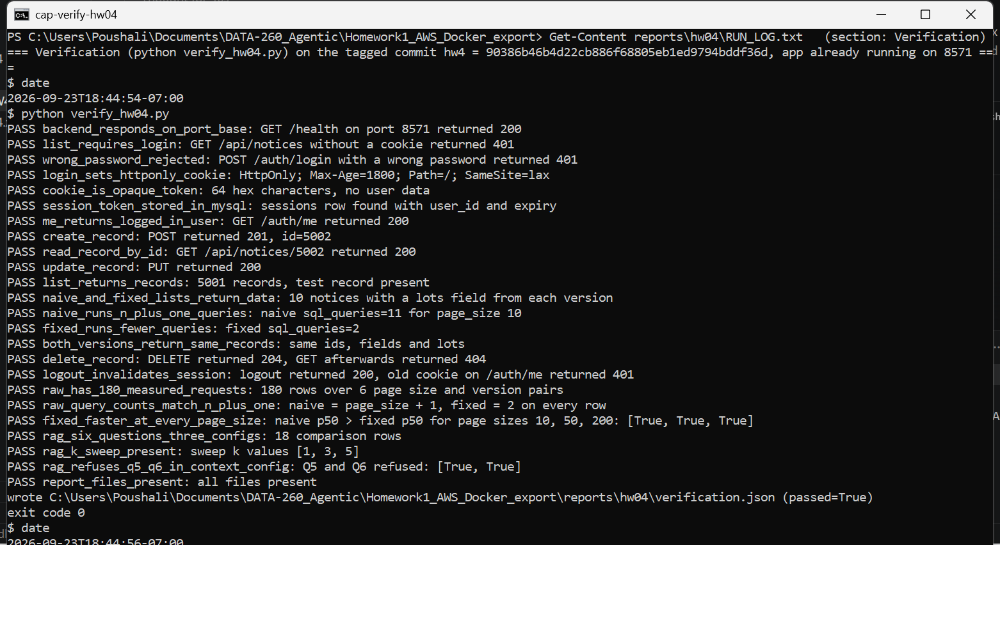

## AI-use statement

Same text as `reports/hw04/AI_USE.md`.

1. I used an AI assistant for debugging and for preparing the report document
   (`report.md` / `report.pdf`). The debugging help covered the SQLAlchemy statement
   counter (keeping the per-request count in a `ContextVar` instead of a module
   variable so that concurrent requests cannot share it), the cookie and CORS
   settings needed between the Vite dev server on port 5173 and FastAPI on port
   8571, the `from_attributes` validation of the nested `lots` list in Pydantic, a
   Windows console encoding error in the RAG printouts, and the reportlab layout. I
   wrote and ran the application code, the React components, the seed and
   measurement scripts, `rag.py`, the six questions and the smoke test myself,
   reviewed every output file, and made the Canvas submission.

2. One thing I verified independently was the SQL statement count that the naive and
   fixed endpoints report, because the whole N+1 table depends on it and the number
   comes from my own event listener rather than from the database. I also checked
   what else the application sends to MySQL around those statements.

3. I turned on MySQL's general log (`SET GLOBAL general_log = 'ON'` with
   `log_output = 'TABLE'`), logged in, sent one naive and one fixed request with
   `page_size=10`, turned the log off and listed the `SELECT` statements it had
   recorded (the listing is in `RUN_LOG.txt`). The log shows exactly what the
   endpoints report: for the naive request one `SELECT ... FROM grocery_notices`
   followed by ten `SELECT ... FROM notice_lots WHERE notice_id = %s`, and for the
   fixed request one notices query followed by a single
   `SELECT ... FROM notice_lots WHERE notice_id IN (...)`. It also shows two things
   the counter does not include: every protected route runs one `SELECT sessions`
   statement (the login check) before the endpoint body starts, and the login itself
   ran two `SELECT users` statements although it only needs one.

4. The second users query came from SQLAlchemy expiring the `User` object when the
   session row was committed, so the response serialisation reloaded it. I created
   `db_session_basede26` with `expire_on_commit=False`, restarted the app and repeated
   the general log check: login now runs one users query and the naive and fixed
   counts are unchanged (11 and 2 for a page of 10, plus the one session lookup).
   The statement count in the results table is left as the count of the endpoint
   body, and the extra session statement is stated next to the table in `METRICS.md`
   and in the report, so the numbers can be checked against the log.
